# ECU-25 Circuit Guide — What, Why, How, and How to Prove It

**Companion to:** the diagrams in `docs/circuits/` and the calculations in `docs/circuits/README.md`.
**Audience:** anyone with basic electronics knowledge. Each circuit gets the same treatment: what it is, why the board needs it, how it works, what the ideal response would be, what **our** circuit actually does (with numbers), how to simulate it before building, and how to read the result. Failure modes close each section.

**Simulation tools referenced below** (all free):
- **Falstad CircuitJS** (falstad.com/circuit, browser) — animated, interactive; use it to *see* a circuit behave.
- **LTspice** (Analog Devices, free; runs on Linux under Wine) — the workhorse for power and transient sims; vendor models available.
- **ngspice / KiCad simulator** — same SPICE engine built into the KiCad schematic editor we'll use for capture.

**General workflow for every circuit:** build intuition in Falstad → get real numbers in LTspice/ngspice → verify the built board against the same pass criteria on the bench. The pass criteria listed under "Reading the result" are the same ones the bench test uses later — simulate once, reuse the checklist twice.

---

## 01 — Power Input Protection

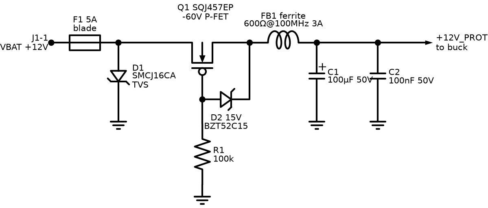

**What:** the front door of the board. Everything the 12 V battery wire carries — good or bad — passes through this circuit first.

**Why needed:** an engine-room battery rail is hostile: cranking collapses it toward 9 V, a battery lead knocked off while charging fires a 60–100 V load-dump transient, a mechanic will eventually connect the battery backwards, and every coil on the machine kicks spikes back into the harness. Unprotected electronics die within weeks in the field.

**How it works:**
- **F1 (5 A fuse)** opens on catastrophic overcurrent — it protects the *wiring harness*, not the semiconductors (fuses act in milliseconds; chips die in microseconds).
- **D1 (SMCJ16CA TVS)** is invisible below 16 V — above the 15 V a healthy 12 V charging system reaches. A transient beyond its ~18 V breakdown avalanches it; it clamps the rail at roughly 26 V while absorbing the pulse energy (it is a bidirectional part even though the schematic shows a single zener symbol).
- **Q1 (P-FET, −60 V)** blocks reverse battery. On correct connection, current initially flows through the FET's body diode, the load side rises, the gate (pulled to ground by R1) is then ~12 V below the source, and the channel turns fully on — drop falls to millivolts. Reversed battery: gate-source polarity is wrong, channel stays off, body diode blocks. **D2 (12 V zener)** stops V_GS exceeding the FET's gate rating during transients.
- **FB1 + C1 + C2** form an LC low-pass filter: the ferrite blocks MHz-range noise both directions, C2 handles high frequency.
- **D3 + C9** are the crank reservoir. A 12 V system sags much further under crank than a 24 V one, so the logic gets a diode-isolated 2200 µF bank: D3 blocks it from draining back into the harness, and the buck runs off the cap while the starter drags the battery down. The relay coils deliberately tap *ahead* of D3 — a G5LE holds in far below its rated coil volts, so it rides the sag without eating the reservoir.

**Ideal response:** DC output exactly equals input for 8–16 V; infinite-speed clamp at exactly 16 V; zero drop; zero reverse current.

**Our response:** ~20–50 mV total drop at 300 mA (fuse + FET R_DS(on)); clamp knee ~18 V, clamping to ≈26 V at rated pulse current; reverse current < 1 µA; C9 holds the logic for **>50 ms** from 10 V down to the 6.5 V UVLO floor with the backlight shed — that is what stops the MCU resetting mid-crank.

**How to simulate (LTspice):**
1. Voltage source → fuse (0.02 Ω resistor) → TVS (use an SMCJ33CA model from Littelfuse's site, or a 36 V zener pair back-to-back) → P-FET (any −60 V PMOS model, e.g. Si7461) with the R1/D2 gate network → 100 µF ∥ 100 nF → 100 Ω load.
2. Three stimulus runs: (a) DC sweep −28 V → +32 V; (b) pulse 12 V → 9 V for 300 ms (crank dip); (c) ISO 7637-2 pulse-5-like load dump: 12 V baseline + 45 V exponential pulse (τ ≈ 40 ms) through 4 Ω source impedance.

**Reading the result:**
- Sweep: output ≈ input above ~3 V, exactly 0 for all negative inputs → reverse protection works. If output goes negative, the FET is drawn backwards.
- Crank dip: output follows input down to 9 V without oscillation.
- Load dump: output never exceeds ~55 V → TVS clamps; check the TVS peak power: (69−53)/4 ≈ 4 A → ~210 W, comfortably inside the 1500 W (10/1000 µs) rating. A stiffer source (1 Ω) would force ~1.9 kW — that run tells you why the fuse and the 4 Ω of real harness matter, and when to upgrade to an SMDJ-size part. If the output rings, the ferrite/C values need damping.

**Failure modes:** TVS fails **short** after absorbing too much energy (safe direction — blows the fuse); FET gate zener missing → FET gate punctures on the first load dump; undersized bulk cap → MCU resets during cranking.

---

## 02 — Buck Converter (12 V → 5 V)

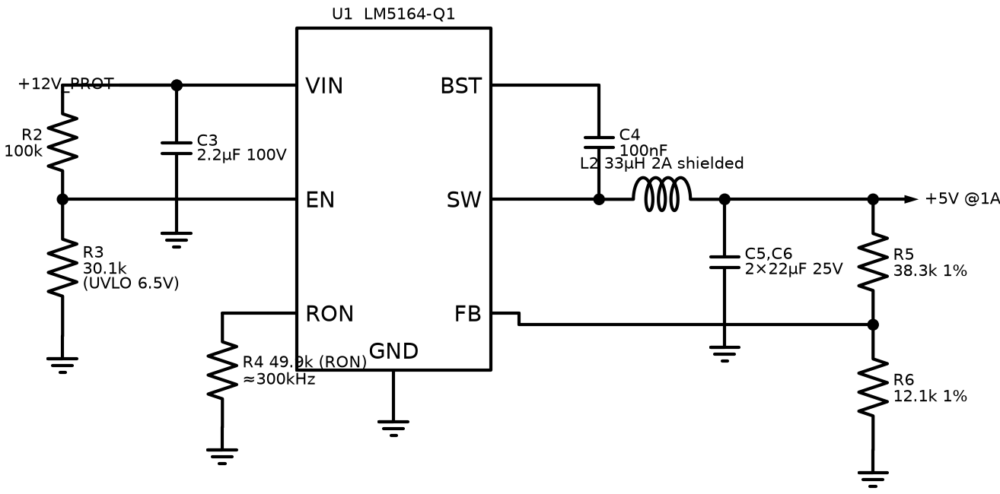

**What:** switching step-down converter, LM5164-Q1, making the 5 V rail (up to 1 A).

**Why needed:** dropping 12 V→5 V linearly at 300 mA would burn ~2.1 W of heat — unusable. A buck converter transfers energy through an inductor instead of burning it: 85–92 % efficient. The LM5164 specifically because its 100 V input rating shrugs off the 53 V clamped load dump that would kill a 36 V-rated converter.

**How it works:** an internal high-side switch connects VIN to L2 for a fraction D of each ~300 kHz cycle (D ≈ V_OUT/V_IN ≈ 42 %). When it opens, the internal low-side FET carries the inductor current (synchronous rectification). L2 + C5/C6 average the chopped waveform to smooth DC. The FB divider (R5/R6 = 38.3k/12.1k against the 1.2 V reference) sets V_OUT = 1.2 × (1 + 38.3/12.1) = 5.00 V. R2/R3 on EN set a **6.5 V** undervoltage lockout, and they sense the **hold-up node** rather than the battery — sensing the battery would trip EN the moment the harness sagged and switch the buck off while C9 was still full. R4 on the RON pin programs the on-time: because RON fixes on-time rather than frequency, the switching rate scales with input volts, so 12 V needs **49.9k** to sit at the same ≈300 kHz that 100k gave at 24 V. C4 bootstraps the high-side gate drive.

**Ideal response:** perfectly flat 5.000 V from 8–16 V input, 0–1 A load, zero ripple, 100 % efficiency.

**Our response:** 5.00 V ±2 %; ripple ≈ 10–30 mVpp at 300 kHz; inductor ripple current ≈ 0.29 A (29 %); efficiency ≈ 88 % at 12 V/0.5 A; survives input to 100 V, so a load dump cannot reach it.

**How to simulate (LTspice):** TI publishes an LM5164 unencrypted PSpice model — import it into LTspice (no built-in equivalent exists there). Build exactly the diagram: 33 µH, 2×22 µF, FB divider, UVLO divider, RON = 49.9k.
1. **Start-up:** step VIN to 12 V, watch V_OUT rise — should settle in ~2 ms, overshoot < 5 %.
2. **Line transient:** VIN triangle 8 → 16 → 8 V over 20 ms — V_OUT deviation < 50 mV.
3. **Load step:** 0.1 → 1 A in 1 µs — V_OUT dip < 150 mV, recovery < 500 µs.
4. **UVLO:** ramp VIN 0 → 12 V slowly — converter must start at ≈6.5 V, not before.
5. **Crank ride-through:** run at 12 V, then drop the source to 0 V for 50 ms with D3 + 2200 µF fitted — the 5 V rail must hold up.

**Reading the result:** ripple much above 50 mVpp → output capacitance/ESR wrong. Ringing on SW node beyond ~1 cycle → layout/parasitic warning for the PCB. Start below 6.5 V in the UVLO run → R2/R3 error. Efficiency: plot V(out)×I(out) / V(in)×I(in); < 80 % means something is misconfigured (usually RON/frequency or inductor DCR).

**Failure modes:** open FB divider → output runs away high (this is why R5/R6 deserve 1 % parts and clean solder); saturated (undersized) inductor → current spikes, hot chip; missing BST cap → converter never starts.

---

## 03 — LDO (5 V → 3.3 V)

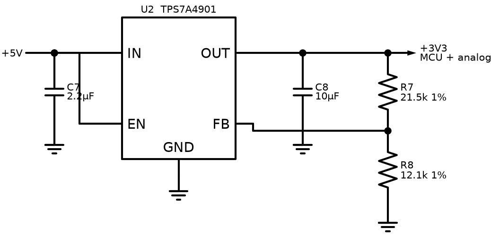

**What:** TLV75533 fixed 3.3 V, 500 mA linear regulator.

**Why needed:** the buck is efficient but electrically noisy — tens of mV of switching ripple. The ADC measures signals where 1 LSB ≈ 0.8 mV; its supply/reference must be quiet. An LDO's PSRR (power-supply rejection) scrubs the ripple. Dropping only 5→3.3 V at ≤300 mA wastes ≤0.5 W — acceptable price for a clean rail. 500 mA rating because the realistic budget (MCU ~100 mA + RS485 driving a terminated bus ~25 mA + display logic ~40 mA + transceivers + margin) put the original 150 mA candidate at its limit.

**How it works:** a pass transistor in series with the output, controlled by an error amplifier comparing the output to an internal reference. Excess input voltage is dropped across the transistor as heat.

**Ideal response:** 3.300 V at any load/input, zero output impedance, infinite PSRR.

**Our response:** 3.3 V ±1 %; PSRR ≈ 40 dB at the buck's 300 kHz switching frequency → its 30 mV ripple arrives at the MCU as < 0.5 mV; dissipation ≈ 0.34 W at 200 mA (warm, no heatsink).

**How to simulate:** barely worth SPICE — two checks suffice. (a) DC: dropout — with a generic LDO model, sweep input 3.0 → 5.5 V at 300 mA load and confirm output holds 3.3 V once input > ~3.6 V. (b) transient load step 50 → 300 mA with 10 µF output cap: excursion should stay < 100 mV. In LTspice use any 500 mA LDO model (e.g. LT1763-3.3, ADI's 500 mA part) as a stand-in; behavior class is identical.

**Reading the result:** oscillation after the load step = output cap ESR outside the stable range (ceramic 10 µF is fine for this part — but this is exactly the check that catches parts that *require* ESR).

**Failure modes:** thermal — if a future revision hangs the LCD backlight on 3.3 V (it belongs on 5 V), the LDO cooks; reversed insertion survives because IN > OUT always here.

---

## 04 — Digital Input Channel (×8)

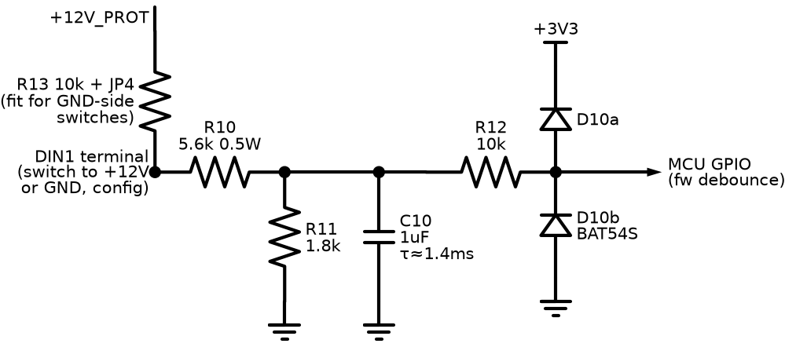

**What:** conditions one on/off field signal (e-stop, oil-pressure switch, remote start…) from metres of engine-bay wire down to a clean MCU logic level.

**Why needed:** a 5 m wire beside a starter cable picks up spikes and noise; the switch at its end bounces mechanically; some engines switch signals to +12 V, others to ground. The MCU pin needs 0–3.3 V, clean, unambiguous.

**How it works:** R10/R11 (10k/3.3k) divide the 12 V level by ≈4; the switch's wetting current (~1.8 mA) keeps mechanical contacts oxide-free. R13+JP4 adds an optional pull-up from the **field terminal** (upstream of R10) to +12 V, so a *ground-closing* switch also produces two distinct states: switch open → terminal pulled to 12 V → node ≈ 3.4 V → HIGH; switch closed → terminal at 0 V → LOW. (Placement matters: hung on the divider node instead, both states would read HIGH — a bug caught in review of this very document.) C10 (470 nF, τ ≈ 1.2 ms) swallows noise bursts; R12 + BAT54S clamp whatever survives to the 3.3 V rails; firmware debounces (3 consecutive 10 ms samples).

**Ideal response:** instant, exact translation: ≥ some threshold → logic 1, below → logic 0, immune to any noise.

**Our response:** node voltage = V_in × 0.248. With STM32 thresholds (V_IH ≈ 2.31 V, V_IL ≈ 0.99 V): input ≥ ~9.3 V reads HIGH, ≤ ~4.0 V reads LOW — dead-band in between rejects floating/leaky wiring. Response delay ≈ 1.2 ms (RC) + up to 30 ms (debounce) — irrelevant for switches. Survives ±40 V continuous.

**How to simulate (Falstad first — this one is satisfying to watch):**
1. Build divider + cap + clamp diodes; drive with a switch to a 12 V source.
2. Add a square-wave source (1 kHz, ±10 V) through a 100 pF cap onto the input node to fake coupled noise — watch C10 eat it.
3. In ngspice: DC sweep input −40 → +40 V; plot node voltage after R12.

**Reading the result:** DC sweep must show the node clamped ≈ −0.3…3.6 V at the extremes (diodes working) and linear ≈ ×0.248 in between. Transient: with the noise source on, the post-filter node must never cross a logic threshold while the switch is steady. If it does, C10 is too small or the noise coupling in the real harness is worse than modeled — increase C10 to 1 µF (delay is still fine).

**Failure modes:** clamp diode leakage at high temperature slightly shifts thresholds (BAT54S is fine to 125 °C); wetting current too low → old rusty pressure switches read intermittently (that's why R10 is 10k/0.5 W, not 100k).

---

## 05 — Resistive Sender Input (×3)

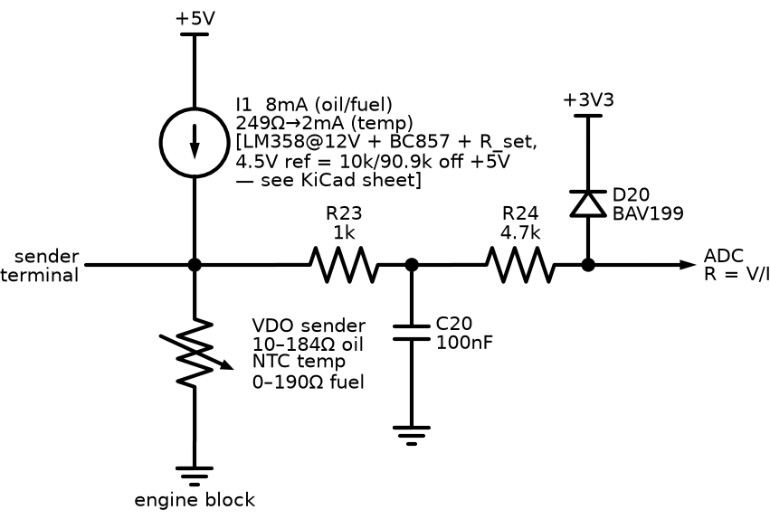

**What:** measures engine gauges' senders — resistances that encode oil pressure (VDO 10–184 Ω), coolant temperature (NTC), fuel level (0–190 Ω).

**Why needed (legacy mode):** on the common-rail engine these values arrive over J1939, but the same board must run older mechanical engines where a resistive sender screwed into the block is all there is.

**How it works:** a precision current source (op-amp + PNP holding a fixed voltage across a set resistor — drawn as the ideal source I1) pushes a known current through the sender to ground; the developed voltage is V = I×R, so resistance falls out directly. 8 mA for the low-resistance oil/fuel senders; 2 mA for the temperature NTC (whose cold resistance is high — 8 mA would rail the source and blind the channel exactly when you care about a cold engine). R23/C20 filter; R24 + BAV199 clamp protects against the classic fault: sender wire chafed onto battery positive.

**Ideal response:** V_ADC = I × R exactly, any R, instantly.

**Our response:** oil: 10 Ω → 81 mV, 184 Ω → 1.48 V (8.06 mA); resolution ≈ 0.1 Ω per ADC count → ≈ 0.006 bar. Temperature at 2.01 mA: 700 Ω (cold) → 1.41 V, 22 Ω (hot) → 44 mV. Compliance: source saturates ≈ 4.4 V → resistances above ~550 Ω (8 mA) / 2.2 kΩ (2 mA) read as "open". Settling ≈ 0.5 ms.

**How to simulate (ngspice/LTspice):**
1. Ideal current source (or the real LM358+PNP+62 Ω circuit if you want to check compliance) into a resistor swept 1 Ω → 2 kΩ (DC sweep).
2. Fault run: connect the sender node through 1 Ω to a 12 V source (wire short) — verify the node after R24 clamps ≤ 3.6 V and current into the clamp stays < 5 mA.
3. Curve check: feed the swept voltage into a lookup of the VDO table — this is exactly the firmware's interpolation, testable in Python before C.

**Reading the result:** V–R plot must be a straight line of slope = I until compliance, then flat — the flat region is your "sender open / broken wire" detection window, read it off the plot. Fault run: if clamp current exceeds a few mA, R24 is too small.

**Failure modes:** ground offset — sender grounds through the engine block; if the block-to-ECU ground wire is poor, every reading shifts (this is why the friend's OEM doc gives each sensor a dedicated return pin — our terminal grouping does the same); current source drift with temperature → use 1 % R_set and a proper reference, not the raw 5 V rail.

---

## 06 — Magnetic Pickup / RPM Input

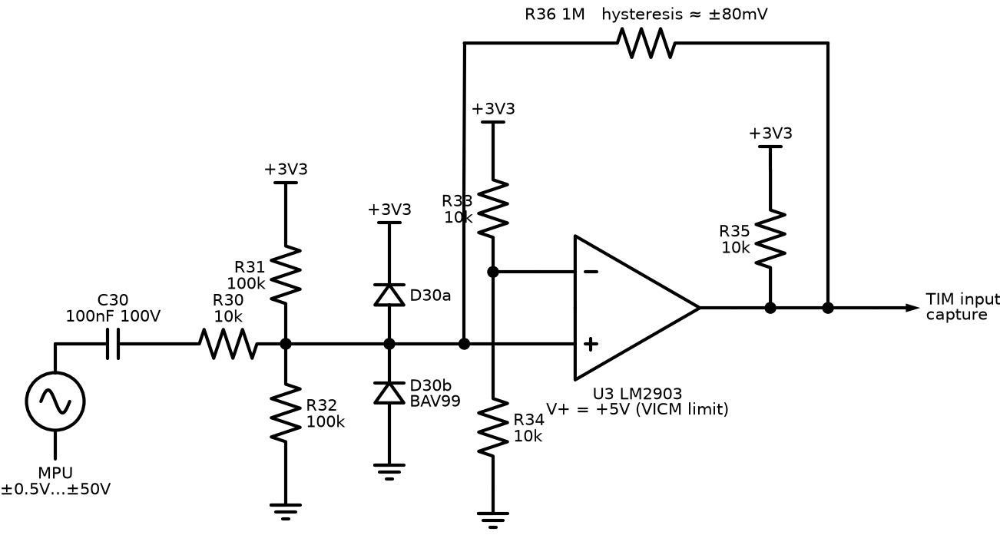

**What:** turns the raw signal of a magnetic pickup (coil facing the flywheel ring gear) into clean digital edges the STM32 timer can count.

**Why needed (legacy + cross-check):** J1939 delivers RPM on the electronic engine, but legacy engines need the MPU, and even on J1939 engines an independent overspeed measurement is good protection practice. Crank disconnect (releasing the starter the instant the engine fires) depends on fast, reliable speed sensing.

**How it works:** the MPU generates one roughly-sinusoidal pulse per passing tooth; amplitude varies wildly with speed (±0.5 V cranking → ±50 V at speed). C30 AC-couples (removes DC), R30 + BAV99 clamp to the rails, R31/R32 bias the signal onto 1.65 V. U3 (LM2903, powered from **5 V** — at 3.3 V its input common-mode range tops out at ~1.3 V, below our 1.65 V bias; reviewer catch) compares against 1.65 V with **hysteresis**: R36 (1 M) feeds the output back so the threshold jumps ±~80 mV apart. Output is open-collector, pulled to 3.3 V by R35 — so the 5 V comparator still speaks 3.3 V logic.

**Ideal response:** exactly one clean edge per tooth at any amplitude, zero noise sensitivity, zero phase delay.

**Our response:** absolute floor ≈ 0.2 Vpp at the connector (that equals the ±80 mV hysteresis window after input attenuation — zero margin); reliable triggering from ≈ 0.5 Vpp, still well below worst-case cranking output; immune to ±80 mV of noise around the threshold; handles ±50 V input; max frequency far beyond flywheel rates (LM2903 propagation ~1.3 µs vs ~100 µs tooth periods). RPM = edge frequency ÷ teeth × 60, config-set teeth count.

**How to simulate (LTspice — the money sim of the input set):**
1. Sine source, amplitude parameter-stepped 0.1/0.5/5/50 V, 100 Hz–5 kHz, through C30/R30 into the bias/clamp network and an LM2903 model (TI provides one) with R36 feedback and R35 pull-up.
2. Add a noise source: second sine, 50 mVpp at 10 kHz, summed at the input.
3. Plot comparator output over input.

**Reading the result:** count output edges per input cycle — must be exactly 2 (one rising, one falling) at every amplitude step. Extra edge bursts near zero-crossings = hysteresis too small (raise by lowering R36). No output at 0.1 V amplitude (0.2 Vpp — inside the hysteresis floor) is acceptable; no output at 0.5 V amplitude is not — check the bias divider. Confirm the clamp: at 50 V input the comparator pin must stay within 0–3.6 V.

**Failure modes:** MPU gap set wrong on the engine (mechanical, not ours — but the symptom is identical to a dead channel, so the commissioning checklist measures MPU AC volts first); cable shield left floating → 50 Hz pickup triggers phantom RPM at standstill — shield lands on AGND at the board end only.

---

## 07 — AC Voltage Sense (×6)

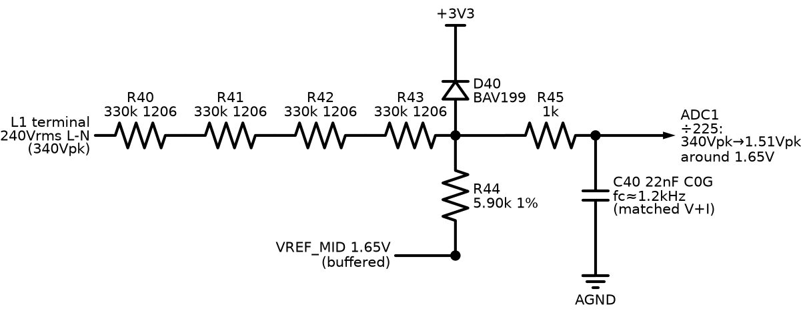

**What:** measures 240 V RMS line-to-neutral (415 V system) with a 3.3 V ADC — three generator phases, three mains phases.

**Why needed:** every AMF decision (is mains healthy? is the generator ready to take load?) and every AC protection (over/under-voltage, over/under-frequency) starts with these six channels.

**How it works:** a 1.32 MΩ chain (4 × 330k, 1206) forms a ÷237 divider with R44 (5.62k), whose bottom sits on the buffered 1.65 V VREF_MID rail — so the ±340 V peak sine becomes a ±1.43 V sine riding on 1.65 V, exactly inside the ADC's 0–3.3 V window. Four series resistors share the voltage (≈85 Vpk each against 200 V ratings) and give physical creepage distance. R45/C40 (1k + 22 nF against the ~5.6k source impedance → fc ≈ 1.1 kHz) rejects aliasing at the ADC. There is deliberately **no isolation** — the measurement network's 0.26 mA maximum fault current is inherently safe, and this is exactly how commercial genset controllers do it. Layout carries the safety: ≥3 mm creepage, AC terminals on their own board edge.

**Ideal response:** V_ADC(t) = 1.65 + V_line(t)/237, zero phase shift, for any line voltage.

**Our response:** 240 V RMS → 1.43 Vpk swing (ADC sees 0.22–3.08 V); channel gain error < ±2 % before calibration (resistor tolerances), calibrated out in firmware; phase lag 2.6° at 50 Hz — matched by the CT channel (fc 1.1 vs 1.06 kHz, Δ < 0.1°), so power/PF math cancels it; clips at ≈276 V RMS — deliberately above the 110 % over-voltage trip point (264 V on a 240 V system), so the protection still reads true values at its own threshold.

**How to simulate (ngspice or LTspice):**
1. Sine source 339 Vpk, 50 Hz → four 330k in series → node → 5.62k to a 1.65 V DC source → R45/C40 → ADC node.
2. AC analysis 10 Hz–100 kHz of the same network (magnitude + phase at the ADC node).
3. Fault run: replace the ADC node with a short to ground; measure source current.

**Reading the result:** transient — ADC node sine centred on 1.65 V, 1.43 Vpk ±2 %; clipping (flat tops) means the divider ratio slipped. AC plot — −3 dB near 1.1 kHz and phase ≈ −2.6° at 50 Hz; write that phase number down, the CT channel must match it within ~0.3° (that's the pass criterion that protects the kW accuracy). Fault run — current ≤ 0.26 mA proves the "inherently safe" claim.

**Failure modes:** one chain resistor fails open → channel reads zero (safe, alarms); C40 leakage or wrong dielectric (use C0G) → gain/phase drift with temperature; neutral wire lost → all three channels ride up together (firmware plausibility check: sum of three healthy phases ≈ 0).

---

## 08 — Current Transformer Input (×3)

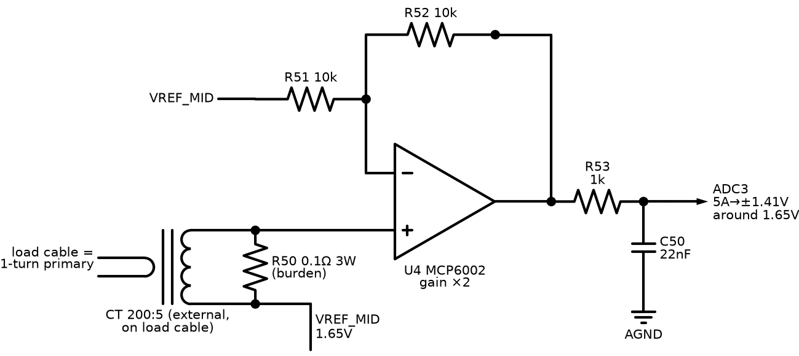

**What:** reads the external 200:5 CTs clamped around the load cables — per-phase current, and with channel 07, kW/PF/kWh.

**Why needed:** overcurrent protection and all power metering. Current can't be sensed through a divider — a CT gives a safe, isolated, scaled copy of hundreds of amps.

**How it works:** the CT secondary (0–5 A) drives R50, a 0.05 Ω burden — a CT is a current source, so the burden converts current to voltage: 5 A → 0.25 V RMS. One burden end sits on VREF_MID; U4 (MCP6002, gain ×2 non-inverting) lifts the small signal to ±0.71 Vpk around 1.65 V. R53 (6.8k) + C50 (22 nF) replicate the voltage channel's filter *exactly* (same fc, same phase lag) so the P = mean(v·i) math sees matched delays. D50 (bidirectional TVS) across the terminals: an **open-circuited CT under load generates dangerous voltage** — if someone unplugs a live CT, D50 clamps it at the connector.

**Ideal response:** V_ADC = 1.65 + I_secondary × 0.1 × 2 exactly, to infinite current.

**Our response:** 5 A (rated) → ±0.71 Vpk; clips at ≈ 11.7 A RMS ≈ 2.3 × rated (0.141 V per A RMS against the 1.65 Vpk rail) — ample for time-graded overcurrent curves; burden dissipates 1.25 W at rated (3 W part, 42 % derating); resolution ≈ 5.7 mA secondary ≈ 0.23 A primary per ADC count.

**How to simulate:**
1. Model the CT as an AC **current source** (7.07 Apk = 5 A RMS, 50 Hz) in parallel with a magnetizing inductance (~1 H) into R50; MCP6002 model (Microchip provides SPICE) with the gain network; R53/C50 to the ADC node.
2. Overload run: step the source to 30 Apk — watch the op-amp clip and D50 stay off.
3. Open-CT run: put a 1 MΩ resistor in place of R50 (simulating a broken burden path) — watch the voltage across D50.
4. AC analysis: phase at ADC node at 50 Hz.

**Reading the result:** rated run: ±0.71 Vpk ±3 %. Overload: clean symmetric clipping (op-amp rails), recovering instantly — no latch-up. Open-CT: without D50 the node flies to hundreds of volts (try it once to respect the failure); with D50 it clamps ~7 V. Phase must match channel 07's number within 0.3°; if not, adjust R53.

**Failure modes:** the #1 field killer — **never open a live CT secondary**; short a CT before unclamping it (D50 is the last line, not the procedure). Burden drift heats → 1 % 3 W part, kelvin-ish routing in layout. Saturated CT on asymmetric fault current under-reads exactly when you need it — a protection-class CT is specified in the manual.

---

## 09 — Relay Driver (×6)

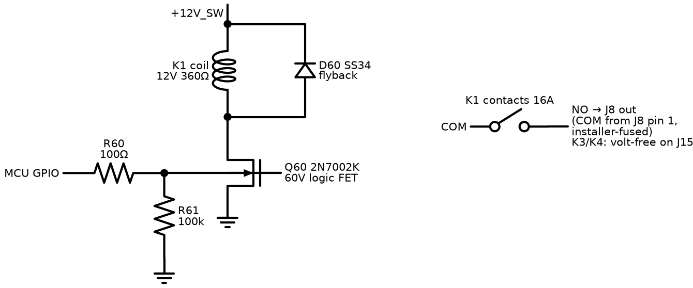

**What:** the MCU-to-relay interface: one logic pin switches one 12 V relay coil (fuel/run-enable, starter, both contactor coils, horn, glow).

**Why needed:** an MCU pin sources ~8 mA at 3.3 V; a G5LE-1-DC12 coil needs 33.3 mA at 12 V (360 Ω). And an inductive coil switched off without protection generates a voltage spike that kills the switch.

**How it works:** R60 feeds the gate of Q60 (2N7002K — **60 V** rated, because the +12V_SW rail legitimately reaches 30 V charging and its TVS only clamps transients at ~53 V; a 30 V FET would sit at zero margin — reviewer catch). R61 (100k) pins the gate low during MCU reset/boot so relays stay off while the firmware isn't in control yet. D60 (SS34) is the flyback path: when Q60 opens, coil current keeps flowing (V = L·di/dt), circulating through D60 and decaying, clamping the drain to one diode drop above the rail.

**Ideal response:** coil energizes/de-energizes exactly with the logic pin, drain sees only 12 V.

**Our response:** turn-on < 1 µs electrical (relay armature adds ~5–10 ms mechanical); coil current 33.3 mA, FET dissipation ≈ 2.2 mW (2 Ω × 33.3 mA²) — cold; drain peak with flyback ≈ V_rail + 0.4 V; release delayed ~2–5 ms by the flyback recirculation (irrelevant here — and the firmware interlock dead-time between K3/K4 is 500 ms anyway).

**How to simulate (Falstad is genuinely fun for this one; LTspice for numbers):**
1. 12 V source → coil model (360 Ω in series with 0.5 H) → NMOS drain; source to ground; 3.3 V pulse (10 Hz) via 100 Ω to gate; 100k gate-ground.
2. Run once **without** D60, plot V(drain). Run again with D60.

**Reading the result:** without the diode the drain spikes to hundreds of volts at every turn-off (in real life: dead FET within cycles). With it: flat clamp at ≈24.4 V. This before/after is the whole lesson of flyback in one plot. Check FET V_DS never exceeds 60 % of rating in the *with* case.

**Contact wiring (KiCad):** FUEL/START/HORN/PREHEAT contacts switch +12V_SW out to J8; the GEN (K3) and MAINS (K4) contactor channels are **volt-free pairs** — COM and NO both go to terminals on a separate block J15, because contactor coils run on their own AC source (gen side / mains side respectively), and the two circuits can sit ~650 Vpk apart — J15 is an 8-pole body with only odd poles wired so the creepage between them is real (PCB review catch). K1 run-enable energizes from PREHEAT onward, not just at crank: a J1939 engine ECU gets its boot time before the starter engages, and in legacy mode the fuel solenoid is simply energized a few seconds early.

**Failure modes:** relay contacts (not coil) wear — the fuel/starter relays switch inductive DC, hardest duty; contact rating and external suppression matter more than this driver. Firmware bug energizing K3+K4 together is caught by the panel's hardware interlock — never rely on this circuit alone.

---

## 10 — CAN Transceiver (J1939)

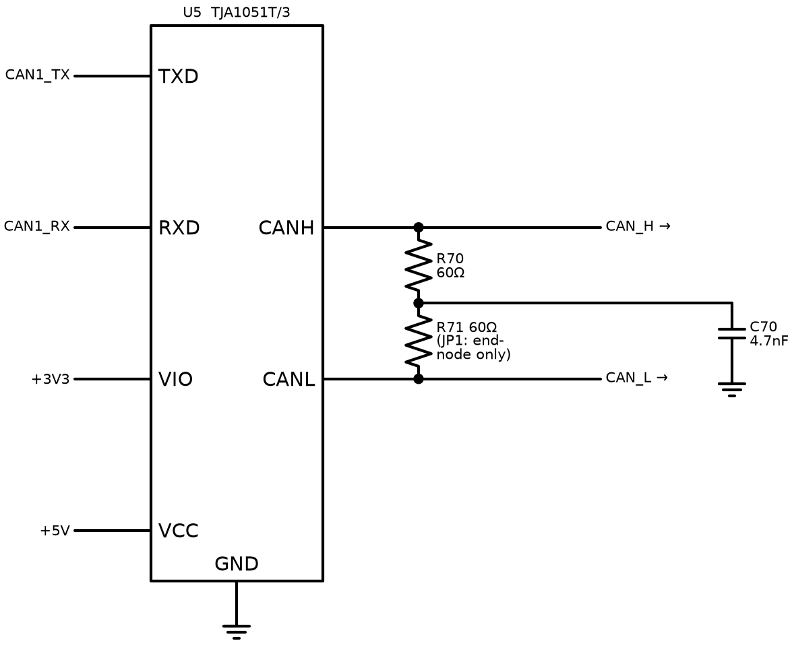

**What:** TJA1051T/3 — converts the MCU's CAN controller logic (TX/RX, 3.3 V) to the differential CAN_H/CAN_L bus where J1939 lives.

**Why needed:** this is the wire to the engine ECU on the common-rail engine — engine speed, temperatures, fault codes, everything. The /3 variant has a VIO pin so its logic side runs at 3.3 V while the bus side runs at 5 V (full standard drive levels).

**How it works:** dominant bit = transceiver actively drives H high / L low (~2 V differential); recessive = both float to ~2.5 V via the termination. Arbitration, ACK, CRC all happen in the MCU's bxCAN peripheral — the transceiver is purely physical layer. R70/R71 (2×60 Ω split) + C76 (4.7 nF) terminate the bus *when this node is a bus end* (JP1): the split-with-capacitor form filters common-mode noise better than a single 120 Ω.

**Ideal response:** perfect differential levels at any bus length, zero emissions, survives any wiring fault.

**Our response:** meets ISO 11898-2: ≥1.5 V differential dominant into 60 Ω (two terminations in parallel); bus pins survive ±58 V DC (someone wiring battery onto CAN); works to 1 Mbit/s (J1939 runs 250 kbit/s).

**How to simulate:** SPICE adds little here — the physical layer is standardized and the interesting behavior is protocol. Instead: **Linux vcan**. `modprobe vcan; ip link add dev vcan0 type vcan; ip link set up vcan0` then `candump vcan0` while a Python script (python-can + j1939 lib) plays engine ECU broadcasting EEC1 at 100 Hz. That simulates everything we actually need to test: address claim, PGN decode, DM1 parsing — before any hardware exists. Electrical checks (termination, levels) happen on the bench with a scope: dominant differential ≈ 2 V, recessive ≈ 0 V, clean edges without ringing = termination correct.

**Reading the result (bench):** staircase-looking or ringing edges → missing/double termination (measure 60 Ω between H and L, power off, both terminations in). Error frames counted by candump → wrong bit timing in the MCU, not the transceiver.

**Failure modes:** both bus nodes terminated *plus* our JP1 fitted = 40 Ω load, marginal levels; unterminated stub runs > 1 m ring at 250 kbit/s.

---

## 11 — RS485 Transceiver (Modbus RTU)

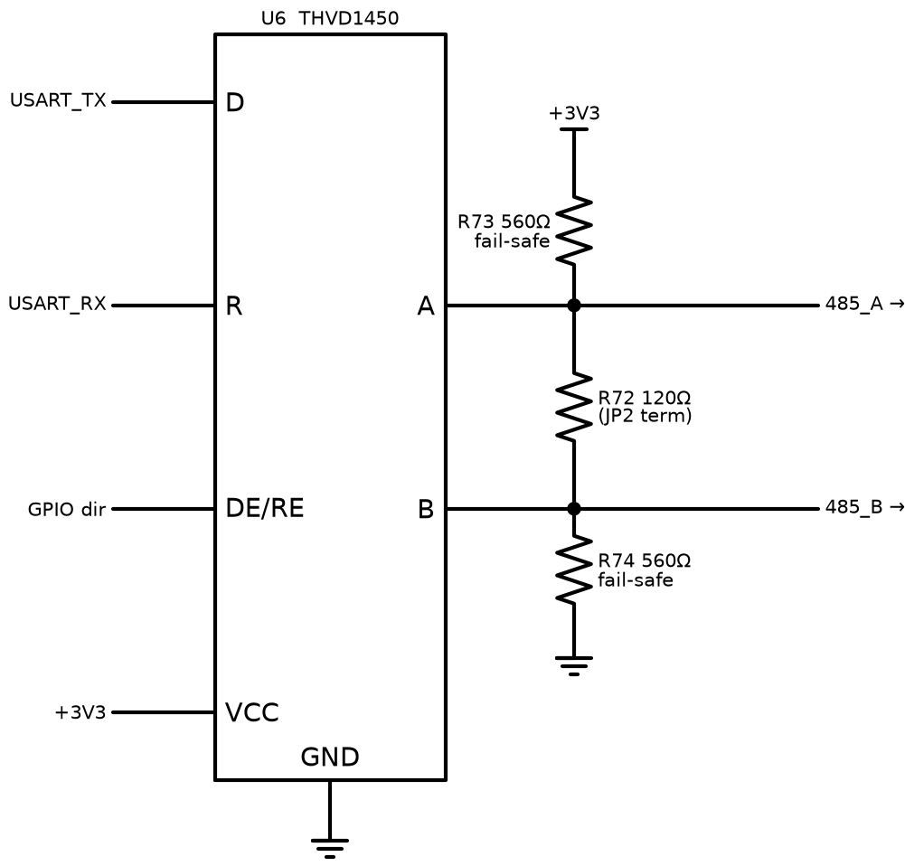

**What:** THVD1450 — the board's industrial serial port; Modbus RTU slave for SCADA/BMS/laptop.

**Why needed:** every building-management system in existence speaks Modbus over RS485; this is the integration port and, before the display firmware exists, the primary debugging window into the running controller.

**How it works:** differential pair A/B, half-duplex: a GPIO flips DE/RE between driver and receiver (Modbus is strictly master-polls/slave-answers, so direction control is trivial). R72 (120 Ω, JP2) terminates at bus ends. R73/R74 bias A above B at idle; the THVD1450 also has a true fail-safe receiver internally, so the bias is belt-and-braces (with two terminations fitted the external bias alone reaches only ≈170 mV — the internal fail-safe is what guarantees a quiet-bus logic state; reviewer correction).

**Ideal response:** error-free bytes at any distance, any node count.

**Our response:** a 50 Mbit/s-class transceiver, so Modbus at 9.6–115.2 kbit/s does not begin to stress it; ±18 kV IEC ESD on bus pins; −7…+12 V common-mode range absorbs ground-potential differences between panel and SCADA room; 1/8 unit load → up to 256 nodes.

**How to simulate:** protocol level, not SPICE: run `pymodbus` master against a stub slave (Python) implementing our register map — this validates the map document and the poll timing before firmware exists. Then the identical master script points at the real board over a USB-RS485 dongle: same expected responses. Electrical: bench scope, same edge-quality reading as CAN.

**Reading the result:** CRC error counter at the master is the health metric — zero at 19200 baud over the bench cable; occasional errors appear only with deliberate termination removal (educational to try).

**Failure modes:** A/B swapped at installation (most common field fault — THVD1450's fail-safe makes it non-damaging, just silent; the manual's wiring diagram matters); missing common ground reference beyond ±12 V common-mode → transceiver stress (third wire / shield to panel ground fixes it).

---

## 12 — MCU Core

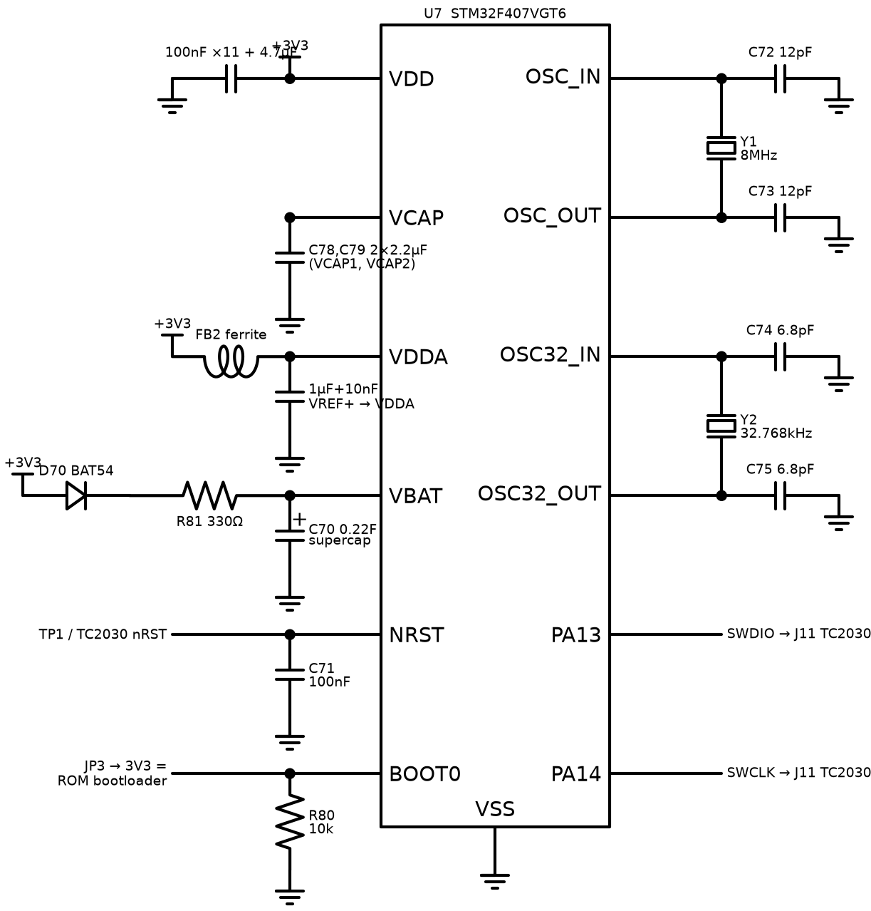

**What:** the STM32F407VGT6 and everything that lets it run: power decoupling, core caps, crystals, reset, boot strap, debug port, RTC backup.

**Why needed:** a bare MCU does nothing — and several of these parts are *mandatory-or-dead*: without the **VCAP capacitors (2×2.2 µF)** for the internal 1.2 V core regulator the chip does not boot at all (reviewer catch — the classic first-spin fatality).

**How it works, block by block:**
- **Decoupling:** 100 nF at *each* of the 11 VDD-class pins + 4.7 µF bulk — the local charge reservoirs for sub-ns current demands.
- **VDDA/VREF+:** analog supply fed through FB2 (ferrite) + 1 µF/10 nF — the ADC's reference is only as clean as this node.
- **Crystals:** 8 MHz HSE (12 pF loads: C = 2(C_L − C_stray) with C_L = 10 pF, stray ≈ 4 pF) — ±30 ppm timebase for CAN bit timing and metering; 32.768 kHz LSE (6.8 pF) for the RTC.
- **VBAT:** BAT54 + **330 Ω** charge the 0.22 F supercap — the resistor stops the LDO current-limiting into a discharged supercap at every cold boot (reviewer catch); RTC + backup registers survive ≈ 60 h unpowered.
- **NRST:** 100 nF + test point + the SWD connector's reset pin; **BOOT0:** 10k down (boot from flash), JP3 to 3V3 forces the ROM UART bootloader — firmware recovery with no debugger.
- **SWD:** PA13/PA14 + NRST on a TC2030 tag-connect footprint (J11) — 6 pads, zero connector cost, flash + live debug.

**Ideal response:** boots every time, every temperature, every supply ramp; clocks exact.

**Our response:** HSE accuracy ≈ ±50 ppm over temperature (crystal + load-cap tolerance) — CAN-safe (needs < 0.5 %), metering-safe; power-on to firmware ≈ 5 ms; brown-out reset via internal BOR at 2.7 V threshold (option byte, set in firmware).

**How to simulate:** you don't SPICE an MCU. Verification is (a) **arithmetic** — the load-cap formula above, redo it if the chosen crystal's C_L differs; (b) **bring-up checklist** on first hardware: 3.3 V present → 1.2 V on VCAP pins → SWD responds (`st-info --probe`) → HSE running (clock-out on MCO pin, measure 8.000 MHz) → LSE running (RTC ticks with VDD removed, supercap holding) → BOOT0 jumper drops into ROM bootloader. Each step isolates one block of this diagram.

**Reading the result:** SWD dead but 3.3 V and VCAP fine → check NRST held low (C71 short?) or SWD wiring; HSE off-frequency > 100 ppm → wrong load caps; RTC loses time overnight → supercap circuit or LSE caps.

**Failure modes:** the VCAP caps and the crystal caps are the two silent killers — both produce "board looks fine, chip dead/flaky" symptoms that cost days if you don't know to look.

---

## 13 — VREF_MID Buffer

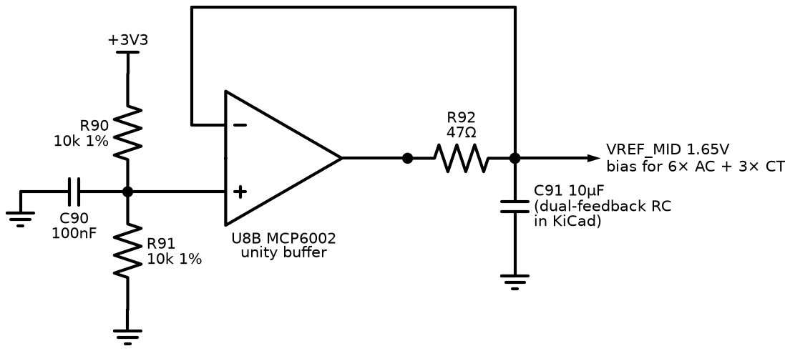

**What:** generates the 1.65 V "artificial ground" that all nine VREF_MID-biased channels (6 voltage + 3 CT) ride on.

**Why needed:** AC signals swing negative; the ADC can't. Everything is lifted to half-rail. Nine channels inject their return currents into this node — a plain resistor divider would wobble with the signals and couple channels into each other.

**How it works:** R90/R91 (10k/10k, 1 %) halve the 3.3 V rail; C90 quiets the divider; U8B buffers it (the op-amp's low output impedance absorbs channel currents). R92 (47 Ω) isolates the op-amp from the bulk capacitance C91 (10 µF) so it stays stable, and the feedback is dual: R93 (10k) takes the **DC** feedback from after R92, so the op-amp actively regulates the far side of the isolation resistor, while C93 (100 nF) closes the loop at **AC** directly from the op-amp output so the R92·C91 pole stays outside the fast loop (reviewer catches, both — with feedback before R92, nine channels' worth of 50 Hz current through 47 Ω would modulate the reference; with only the DC path, the buffer oscillates).

**Ideal response:** 1.650 V rock-solid at DC and at 50 Hz regardless of what all nine channels do.

**Our response:** DC ≈ 1.65 V ±1 %; output impedance at 50 Hz ≈ a few ohms (feedback + 10 µF) → worst-case nine-channel injection (~1 mApk aggregate) wobbles the reference < 3 mV — under 2 ADC counts, and common-mode to all channels (cancels in the differential math anyway).

**How to simulate (ngspice/LTspice):**
1. MCP6002 model, exact network.
2. **Stability:** transient, 10 mA load step at the output, 1 µs edge — ringing must decay within ~3 cycles (phase margin proxy).
3. **Injection:** 50 Hz AC current source (1 mApk) into the output; measure output AC amplitude.
4. Compare feedback-before vs feedback-after R92 (one wire move) — see the reviewer's point in one plot.

**Reading the result:** injection run: < 3 mV with feedback-after, ~45 mV with feedback-before — that 15× is the design justification. Sustained oscillation in the step run = C91/R92 ratio wrong.

**Failure modes:** buffer op-amp dies → all nine AC channels read garbage *simultaneously* (firmware plausibility check: VREF_MID has its own ADC monitor channel in KiCad — cheap insurance).

---

## 14 — Switched 12 V Rail (+12V_SW)

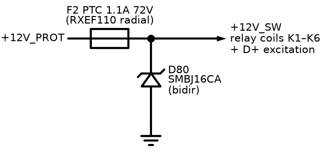

**What:** a separately-fused branch of the protected battery rail feeding the six relay coils and the D+ excitation.

**Why needed:** coils are the board's biggest, dirtiest load. A stuck relay or shorted coil must not drag down the rail that feeds the MCU's buck converter — fault isolation between "muscle" supply and "brain" supply.

**How it works:** F2, a PTC resettable fuse (**RXEF110, 1.1 A hold, 72 V radial** — while tripped it stands off the full rail including the ~53 V load-dump clamp, and no chip PPTC manages that at 1.1 A hold: the 1206 parts are 8 V and the 1812 parts 33 V, BOM review catch), passes the ≈0.2 A of six coils plus the 0.1 A D+ excitation — field loads are no longer on this rail but heats and goes high-resistance on a fault, disconnecting the branch; it self-recovers when the fault clears and it cools. D80 (SMBJ33**CA**, bidirectional across the rail) clamps the switching transients that six coils generate locally — bidirectional deliberately, so no footprint orientation can turn it into a forward diode across the rail (schematic-review catch).

**Ideal response:** transparent at ≤ 0.4 A forever; instant disconnect on any fault; instant recovery.

**Our response:** PTC trips in ~seconds at 2× hold current (PTCs are slow — that's fine, the harm model is thermal, not electronic); adds ~0.15 Ω series resistance (0.06 V at full coil load — irrelevant to 12 V coils); recovery after ~1 min cool-down.

**How to simulate:** barely needed — one LTspice run with the PTC as a behavioral resistor (R = 0.15 Ω below 1.1 A, 100 Ω above 2.2 A after 3 s) demonstrates the isolation: short the +12V_SW output and watch +12V_PROT stay up (buck keeps running). That plot is the circuit's entire justification.

**Reading the result:** if +12V_PROT dips more than momentarily during the simulated coil short, C1 upstream is undersized or the fault path bypasses F2.

**Failure modes:** PTC ages (trip events raise its cold resistance); all-relays-on + hot enclosure narrows the margin to hold current — 1.1 A hold vs 0.4 A load is deliberately generous.

---

## 15 — Battery Voltage Sense

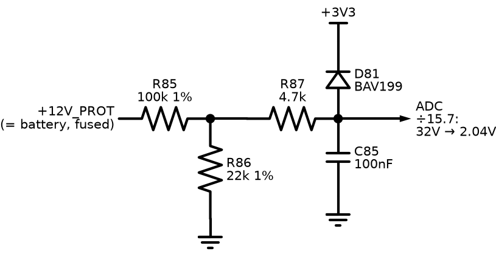

**What:** measures the battery/rail voltage — battery high/low alarms, charge monitoring context.

**How it works:** R85/R86 (100k/6.8k = ÷15.7) scale 0–51 V into the ADC range; R87 + BAV199 clamp faults; C85 filters.

**Ideal / ours:** ideal — exact ratio, instant. Ours — 12 V → 1.53 V, 32 V → 2.04 V; resolution 12.6 mV of battery per count; τ ≈ (100k∥6.8k + 4.7k)×100 nF ≈ 1.1 ms.

**Simulate:** DC sweep 0–60 V in ngspice; verify linearity to 51 V and clamp beyond. One minute of work — do it inside KiCad when the sheet is drawn, as the first "the simulator works" smoke test.

**Reading:** slope error > 2 % = wrong E96 value fitted (the assembly-error detector).

**Failure modes:** divider resistor drift is the calibration-stability limit — 1 % 100 ppm parts.

---

## 16 — Charge Alternator D+ (Excite + Charge-Fail)

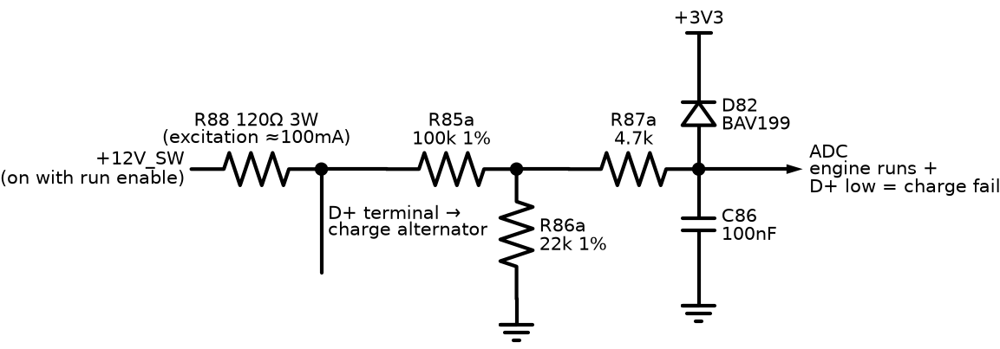

**What:** two jobs in one node: feeds the charge alternator its wake-up (excitation) current, and watches whether it actually charges.

**Why needed:** a genset that quietly stops charging its own battery will fail to start at the next power cut — charge-fail is a classic, mandatory genset warning. And without excitation current (the job the dashboard warning lamp does in a car), many charge alternators never wake up at all.

**How it works:** R88 (220 Ω, 5 W — sized to survive *continuous* dissipation when the alternator is dead, which is exactly the fault condition it lives through) sources ≈100 mA from +12V_SW into D+. Engine stopped: D+ sits low (alternator windings pull it down) — that's normal. Engine running: a healthy alternator drives D+ up to ≈ battery volts. The divider (÷15.7, same as ch.15) + clamp + C86 feed the ADC.

**Ideal / ours:** ideal — binary flag. Ours — analog: D+ ≈ 26–28 V (1.7 V at ADC) = charging; engine-running + D+ < ~50 % of battery = **charge fail** warning after a qualification delay (belt snapped, alternator dead, wire off).

**Simulate:** DC only: model the alternator as a switch — 100 Ω to ground (dead/stopped) vs a 27 V source (charging). Check: dead case node ≈ 24×100/(220+100) ≈ 7.5 V at D+ (0.48 V at ADC — reads "not charging" ✓ and R88 dissipates (24−7.5)²/220 ≈ 1.2 W… peak case with D+ fully shorted: 2.6 W → the 5 W rating).

**Reading:** the two simulated ADC values (≈0.5 V vs ≈1.7 V) are the firmware thresholds, with the decision band between them.

**Failure modes:** wrong R88 wattage cooks on the first broken belt (the fault it exists to report); some alternators need more excitation current — R88 value is a config-note per engine model in the manual.

---

## 17 — EEPROM (Config + Fault Log)

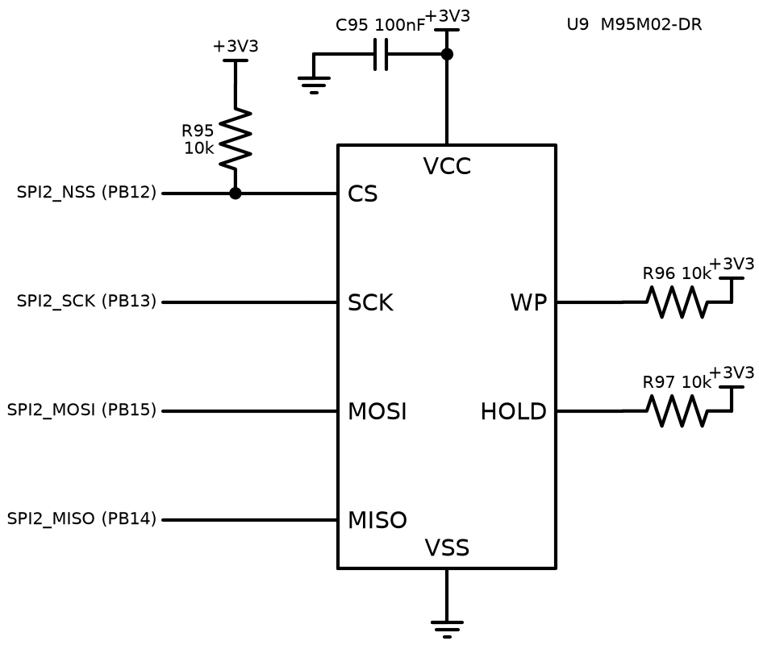

**What:** M95M02-DR, 256 KB SPI EEPROM — all user configuration and the black-box fault log.

**Why needed:** settings must survive power-off and firmware updates; the fault log must survive everything. MCU flash is wrong for this: large erase sectors, ~10 k cycle endurance, CPU stalls while writing. EEPROM: byte-writable, 4 M cycles, independent of firmware images.

**How it works:** plain SPI2 (PB12–15). R95 pulls CS high so the chip ignores the bus while the MCU boots/reset (floating CS during boot = corrupted first byte, a classic). WP/HOLD tied high — write protection is handled in software (CRC + versioned blocks), not pins.

**Ideal / ours:** ideal — infinite, instant, incorruptible storage. Ours — 5 ms page write (firmware queues writes, never blocks the control loop on them); config block is CRC-guarded and versioned: corrupt read → load defaults + raise alarm, never run on garbage.

**Simulate:** nothing analog to simulate. Verified by firmware unit tests on the host: the config module compiles on PC with a RAM-backed fake EEPROM; tests cover CRC-corruption, version-migration, power-cut-mid-write (write journal). This is SIL testing, and it's *more* rigorous than anything SPICE could say here.

**Reading:** all host tests green + on-target read-back of a written pattern after power cycle = done.

**Failure modes:** power dies mid-write → journaling (write to alternate block, commit pointer last); wear — 4 M cycles ÷ (1 write/min continuous) ≈ 7.6 years, and the fault log is circular so wear spreads.

---

## 18 — Display Board

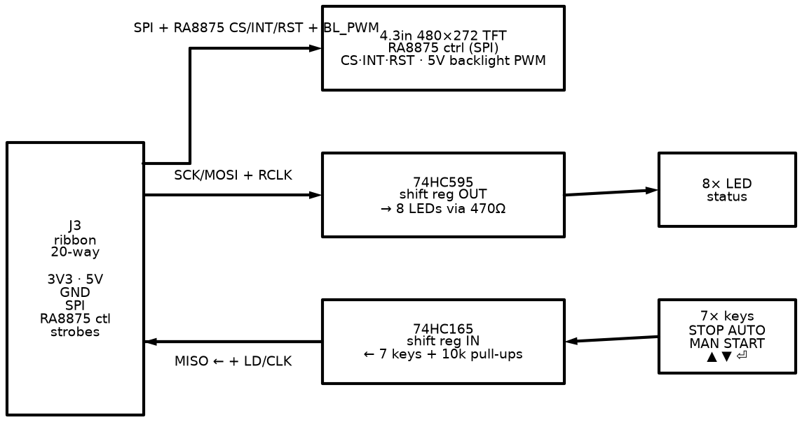

**What:** the human face: 4.3" 480×272 color TFT (phone-size), 7 keys, 8 status LEDs, on its own PCB behind the panel door, one 20-way ribbon to the main board.

**Why needed:** operators start/stop the set, read voltages, and see alarms without a laptop. Separate board: display lives at eye level, main board lives deep in the panel; only logic-level signals plus the 5 V backlight feed cross the ribbon.

**How it works:** everything shares the one SPI bus with separate selects. The TFT is driven by an **RA8875 graphics controller** — it owns the framebuffer RAM and a hardware drawing engine (lines, rectangles, fonts, block moves), so the MCU sends short SPI commands instead of streaming 480×272×16-bit frames (which SPI could never sustain and a bare F407 could never buffer). The 74HC595 latches 8 LED states on its RCLK strobe; the 74HC165 parallel-loads 7 keys and shifts them back on MISO. Bus cost: 20 wires including both supplies and backlight PWM.

**Ideal / ours:** ideal — instant, flicker-free, debounced. Ours — LVGL redraws only changed regions through RA8875 primitives; typical page update well under the 50 ms HMI tick (flicker-free), keys sampled at 100 Hz with 30 ms debounce, LED update ~µs. Backlight PWM ≥200 Hz, 5 V ≈ 250 mA.

**Simulate:** logic, not SPICE. **LVGL's PC simulator** is the primary tool: the entire UI — every page, menu, alarm popup — runs on the desktop with mouse-as-keys, pixel-identical to the target. Screenshots from it are the review artifact; the same C code then compiles for the board with the RA8875 driver underneath.

**Reading:** simulator screenshots of every page get approved before a single component is soldered.

**Failure modes:** ribbon length > ~50 cm at SPI speed → ringing (slow the clock or shorten); TFT backlight LEDs dim with age (PWM headroom covers it); RA8875 needs a defined reset sequence at power-up or it wedges — the RST line on the ribbon exists for exactly that.

---

## Cross-cutting: what "verified" means at each stage

| Stage | Tool | What it proves |
|---|---|---|
| Design math | this doc + `circuits/README.md` | values are self-consistent |
| Independent review | separate reviewer, all calcs re-derived | no author blind spots (done 2026-08-11; all findings fixed) |
| Simulation | recipes above | dynamic behavior: transients, clipping, phase, stability |
| SIL (host) tests | fake engine + real firmware modules | logic: state machines, protections, config, comms — thousands of scenarios/second |
| Bench bring-up | PSU, signal gen, scope, per-circuit pass criteria | the physical board matches the sims |
| Staged commissioning | the real genset, supervised | the system works where it must |

Each circuit's "Reading the result" criteria are deliberately written to be reusable verbatim at the bench stage — simulate once, test twice, same numbers.
