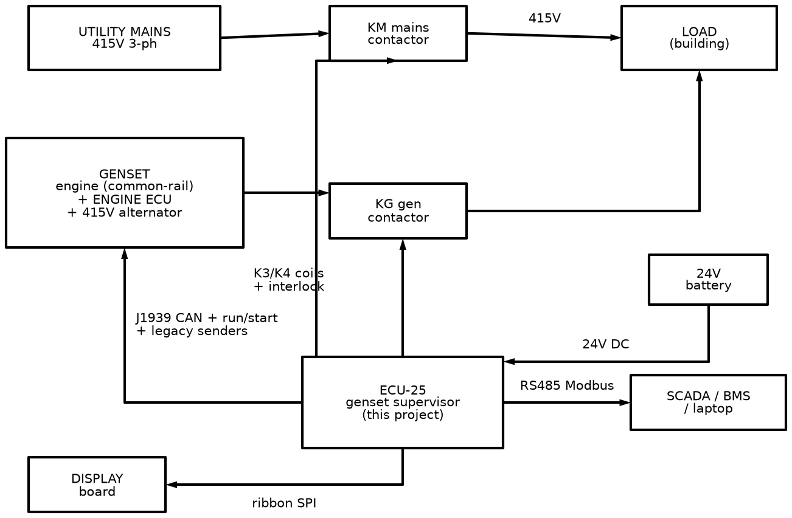
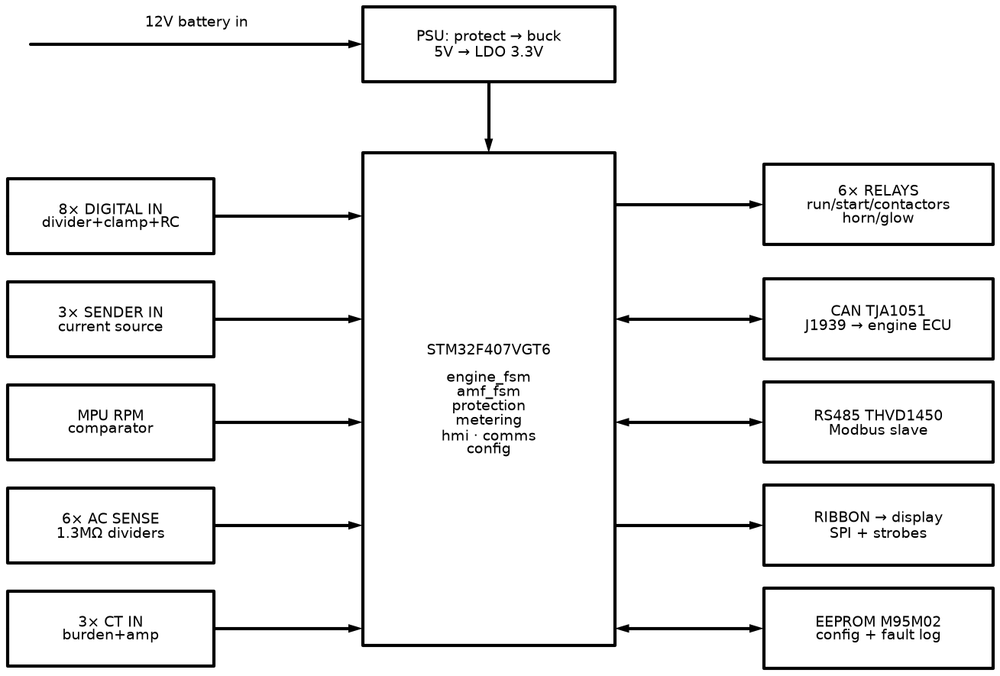
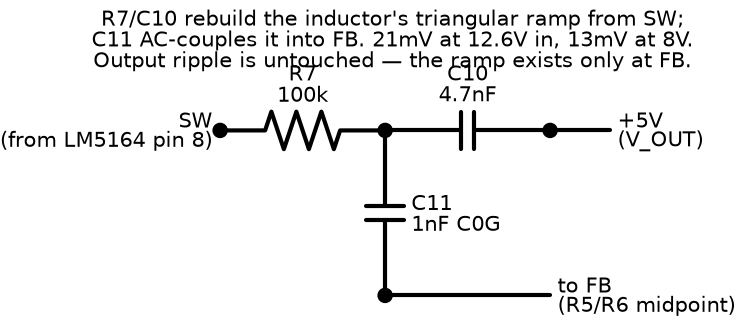

# The ECU-25 Project Bible

**What this document is:** the whole project, top to bottom, in one place. It starts with the machine ECU-25 controls and the reasons the board is shaped the way it is, then walks down into every circuit block with its own diagram and its own explanation, then covers the firmware that ties it all together, then the physical build, the safety plan, and where the project actually stands today.

**Who it's for:** anyone who wants to understand ECU-25 completely — a new contributor picking up the project, a reviewer checking the design, or either of us six months from now trying to remember why a resistor is the value it is. Basic circuit theory and programming knowledge are assumed; nothing specific to gensets or automotive electronics is assumed — that part is explained as it comes up.

**Companion documents**, for the detail that belongs in tables rather than prose:
- `docs/io-map.md` — every signal measured and every output driven, with terminal numbers, scaling, and MCU pins.
- `docs/circuit-guide.md` — the same circuits covered here, with simulation recipes and bench pass criteria added, for anyone building and testing the board.
- `docs/bom/ecu25-main-bom.md` — the parts list.

---

## Table of Contents

- **1.** [What We Are Building](#1-what-we-are-building)
- **2.** [How the Board Is Organized](#2-how-the-board-is-organized)
- **3.** [Staying Alive: The Power Supply](#3-staying-alive-the-power-supply)
- **4.** [The Brain: MCU, Memory, and Debug](#4-the-brain-mcu-memory-and-debug)
- **5.** [Reading the Engine](#5-reading-the-engine)
- **6.** [Reading the 415 V Power](#6-reading-the-415-v-power)
- **7.** [Taking Action: Relay Outputs](#7-taking-action-relay-outputs)
- **8.** [Talking to the World](#8-talking-to-the-world)
- **9.** [The Human Interface: Display Board](#9-the-human-interface-display-board)
- **10.** [Firmware: How the Decisions Get Made](#10-firmware-how-the-decisions-get-made)
- **11.** [Physical Build](#11-physical-build)
- **12.** [Safety and Test Plan](#12-safety-and-test-plan)
- **13.** [Where the Project Stands Today](#13-where-the-project-stands-today)
- **14.** [Glossary](#14-glossary)

---

## 1. What We Are Building

A **genset controller** is the box on the front of a diesel generator panel. It has one job made of several parts:

1. **Start and stop the engine**, safely and automatically.
2. **Protect** the engine and alternator — shut down before something expensive breaks.
3. **Measure** everything that matters: engine sensors, battery, and the 415 V three-phase output.
4. **Transfer the load.** When utility mains fails, start the genset and switch the building onto it. When mains returns, switch back and stop the engine. This automatic behaviour is called **AMF — Auto Mains Failure**.
5. **Talk to the outside world** — a display for the person standing at the panel, Modbus for a building-management system, CAN/J1939 for the engine's own electronics.

Commercial products in this class include the Deep Sea Electronics DSE 4520, ComAp InteliLite, and Smartgen HGM6120. This one is called **ECU-25** — an ECU for a 25 kVA genset. It is an original design: same feature class as those products, but every circuit here is worked out from first principles rather than copied from a reference design. That means we can build, modify, and eventually manufacture it freely, and — the part that actually matters day to day — we understand every part of it, because we derived every part of it.

### The machine it controls

The target is a Kirloskar KG4-25WS1, 25 kVA / 415 V / 50 Hz, built around a Kirloskar 3R550ETA 4G1 engine: a 3-cylinder, 1.65-litre common-rail diesel meeting CPCB IV+ emissions norms, with EGR and a diesel oxidation catalyst. It breaks down as:

- A **diesel engine**, roughly 30–40 HP, fitted with a **mechanical governor** — a flyweight mechanism inside the fuel pump that holds engine speed at 1500 RPM on its own. Because the governor is mechanical, ECU-25 does not control speed. It controls only **fuel on/off** and the **starter motor**.
- An **alternator** bolted to the engine, producing 415 V line-to-line, three-phase, 50 Hz once the engine reaches 1500 RPM. Frequency is locked to speed — a 4-pole alternator gives exactly 50 Hz at exactly 1500 RPM — which is why speed protection and frequency protection are really the same measurement taken two different ways.
- A **12 V battery system**: battery, starter motor, and a small charge alternator, the same kind fitted to any road vehicle, that recharges the battery while the engine runs.

The engine is a **common-rail electronic diesel** with its own engine-management ECU controlling injection, rail pressure, EGR, and the DOC. That changes ECU-25's role from "drive the engine directly" to "**supervise the engine over J1939**": start and stop through a run-enable relay plus CAN, with engine speed, oil pressure, coolant temperature, and fault codes read from the engine ECU's own broadcasts rather than measured directly. Everything else — AC metering, protections, the AMF transfer logic, the display, Modbus — is unchanged by this. The analog sender inputs, the magnetic-pickup RPM input, and the fuel-solenoid relay described later stay in the hardware as a **legacy mode**, so the same board can also run an older genset with a mechanical-governor engine and no CAN bus at all. Wherever the text below says "fuel solenoid", the electronic engine reads that as "run enable".

### The complete installation

```
   UTILITY MAINS (415V 3ph)                DIESEL GENSET
   L1 L2 L3 N                              ┌─────────────────────────────────────┐
        │                                  │            fuel solenoid (K1)       │
        │                                  │                  │                  │
        │                                  │              ┌───▼────┐   shaft  ┌──┴──────┐
        │                                  │  starter ───►│ ENGINE ├══════════► ALTERNATOR
        │                                  │  motor (K2)  └───┬────┘          └──┬──────┘
        │                                  │                  │ flywheel         │ 415V 3ph
        │                                  │           MPU ◄──┘ teeth            │
        │                                  │  12V BATTERY ◄── charge alternator  │
        │                                  └─────────────────────────────────────┘
        │                                                                        │
        ▼                                                                        ▼
   ╔═══════════╗                                                          ╔═══════════╗
   ║ KM mains  ║◄── coil driven by K4                  coil driven by K3 ─►║ KG gen    ║
   ║ contactor ║        INTERLOCKED: never both closed                    ║ contactor ║
   ╚═════╤═════╝                                                          ╚═════╤═════╝
         │                            ┌─────────┐                               │
         └────────────────┬──────────►│  LOAD   │◄───────────┬──────────────────┘
                          │           │(building)│           │
                         CTs ─────────└─────────┘            │
                          │                                  │
                          ▼                                  ▼
                ┌────────────────────────────────────────────────┐
                │                    ECU-25                       │
                │ senses: mains V, gen V, load I (CTs), senders,  │
                │         RPM, battery, D+, switches              │
                │ drives:  K1 fuel · K2 starter · K3/K4 contactor │
                │         coils · K5 horn · K6 glow               │
                └────────────────────────────────────────────────┘
```

One picture, the whole job: watch both power sources, run the engine when needed, and decide which contactor feeds the load — never both at once.

---

## 2. How the Board Is Organized




ECU-25 is split across **two circuit boards**, connected by a single ribbon cable.

The **main board** carries the 415 V sensing networks, the relay contacts, and the switching power supply. It wants to live deep inside the panel, close to the fat field wiring. The **display board** carries the screen and keypad, and wants to sit on the panel door at eye level, where an operator can reach it. Splitting the two means each board's layout stays simple, the display can be redesigned or upgraded without touching the main board, and — the safety-relevant part — nothing above logic level ever has to cross the ribbon to the door a person's hand rests on. This is how commercial controllers in this class are built internally as well.

### Signal flow through the main board

Inputs, on the way in:

```
 FIELD WIRING            CONDITIONING                    MCU
 ────────────            ────────────                    ───
 12V battery ──────► fuse·TVS·revFET► buck 5V► LDO 3.3V── power to everything

 8x switches ──────► divider+clamp+RC ────────────────► GPIO
 3x senders ───────► current source + filter ─────────► ADC
 battery V, D+ ────► dividers ─────────────────────────► ADC
 MPU (RPM) ────────► comparator + hysteresis ──────────► TIM capture

 gen L1 L2 L3 ─────► 1.3MΩ dividers + bias ──────► ADC1 ┐
 mains L1 L2 L3 ───► 1.3MΩ dividers + bias ──────► ADC2 ├─ sampled together
 3x CT 5A ─────────► burden + bias ──────────────► ADC3 ┘

 SWD debug ◄─────────────────────────────────────────► SWD
 CAN bus  ◄──── TJA1051 transceiver ◄─────────────────► CAN1
 RS485 bus ◄─── THVD1450 transceiver ◄────────────────► USART
```

Decisions, on the way out:

```
                   MCU — STM32F407                        OUTPUT STAGE
                  ┌──────────────┐
  all readings ──►│ engine_fsm   │
                  │ amf_fsm      │──► FET drivers (x6) ──► K1 fuel solenoid
                  │ protection   │                         K2 starter
                  │ ac_sense     │                         K3 gen contactor
                  │ sensors      │                         K4 mains contactor
                  └──────┬───────┘                         K5 alarm horn
                         │                                 K6 glow plugs
                         ├─ SPI ► EEPROM (config, fault log)
                         └─ SPI ► ribbon ► DISPLAY BOARD
```

Read it left to right: raw field signals enter on the left, each one gets tamed by its own conditioning circuit, the microcontroller in the middle decides what to do, and decisions leave on the right through relay contacts. Every part of this document from here on explains one row of this picture in detail — what the block does, why it needs to exist, and what happens if it is left out.



The main-board subsystem diagram (`00b-main-board-subsystems.png`) shows the same picture grouped by physical zone on the board: power supply, MCU and memory, digital and sender inputs clustered together, the 415 V sensing network kept on its own edge of the board, relay drivers next to the connectors they drive, and the two communication transceivers beside the connectors they serve. Physical grouping matters here for the same reason as the two-board split — keeping the high-voltage sensing network physically separate, with generous spacing to everything else, is a safety property of the layout, not just tidiness.

---

## 3. Staying Alive: The Power Supply


The supply chain, in order:

```
12V battery → fuse → TVS clamp → reverse-polarity MOSFET → ferrite + bulk caps
           → LM5164-Q1 buck (12V → 5V) → TLV75533 LDO (5V → 3.3V)
```

### 3.1 What the input has to survive

The battery rail on a running engine is one of the more hostile electrical environments in electronics, for four specific reasons:

- **Cranking dips.** When the starter motor engages it draws hundreds of amps, and the 12 V rail sags — briefly down to 9–10 V. If the 5 V and 3.3 V rails collapse during that dip, the microcontroller resets in the middle of the start sequence. That is not acceptable, so the input has to work continuously across 8–16 V, with a bulk capacitor sized to ride through the worst of the dip.
- **Load dump.** The classic automotive fault: the battery cable comes loose (or is disconnected) while the charge alternator is charging hard. The alternator's magnetic field cannot collapse instantly, so the rail voltage flies upward — in a 12 V system, transients approaching 60–100 V for tens of milliseconds. Anything not designed for this fails.
- **Reverse battery.** A mechanic connects the battery backwards. It happens routinely in the field, and the design has to block it harmlessly rather than let it destroy the board.
- **Inductive spikes.** Every solenoid, relay coil, and injector on the machine kicks a voltage spike back onto the rail when it switches off.

The relevant standard, for reference rather than formal certification, is **ISO 7637-2**, which defines these transient pulses precisely.

What the rail actually looks like across a start/stop cycle:

```
 V
 60┤                                  ╭╮ load dump — UNPROTECTED could reach here
   │                                  ││
 26┤ · · · · · · · · · · · · · · · · ·││· · TVS clamps it to ~26 V
   │                                  ││
 16┤            charging              │╰──╮
 14┤        ╭─────────────────────────╯   ╰────
12.6┤────╮   │                                   nominal (rest)
   │    │   │
8.5┤    ╰╮ ╭╯  ◄── crank dip (starter draws 100s of amps)
   │     ╰─╯       board must stay alive through this
   └──────┬───┬───────────────┬──────────────── t
        crank engine        battery lead
              fires         knocked off
```

### 3.2 The protection chain


**F1 (5 A fuse)** is a last resort: if something on the board fails short, the fuse opens before the wiring harness catches fire. It protects the *wiring*, not the electronics — a fuse acts in milliseconds, and a semiconductor can die in microseconds, so nothing downstream of it should be relying on it for its own protection.

**D1 (SMCJ16CA TVS diode).** A transient voltage suppressor is a purpose-built avalanche diode. Below its standoff voltage of 16 V it is electrically invisible. Above its breakdown voltage of roughly 18 V it avalanches and clamps the rail at about 26 V, absorbing hundreds of watts for the duration of the pulse. It is the part that eats the load dump. Worth stating plainly: a 16 V standoff means this is a 12 V board and nothing else. Jump-starting the set from a 24 V source drives the TVS into hard conduction and it fails short — the safe failure mode, but the board is destroyed either way. That is a deliberate trade: tight clamping for a 12 V system, at the cost of zero tolerance for a 24 V mistake.

**Q1, the reverse-polarity P-channel MOSFET.** The textbook answer to reverse-battery protection is a series diode, but a diode drops about 0.7 V continuously — wasted power, and reduced headroom during a crank dip when headroom is exactly what's needed. The better answer used in production designs is a P-channel MOSFET wired source-toward-the-load, gate pulled to ground through a resistor. With the battery connected correctly, the gate sits about 12 V below the source, the channel turns fully on, and the voltage drop across it is just current times on-resistance — a few millivolts. With the battery reversed, the gate-source voltage has the wrong sign, the channel stays off, and the body diode blocks current from flowing at all. A zener diode on the gate stops it exceeding its rated voltage during a transient.

```
                 P-channel MOSFET
              D ┌──────────┐ S
   VBAT ────────┤   ─►|─   ├────────┬─────► +12V_PROT (to buck)
   (fused,      └────┬─────┘        │       body diode conducts first,
    TVS-clamped)     │gate          │       then FET turns on and
                     ├──[zener]─────┘       shorts it out (mV drop)
                     │
                   [100k]
                     │
                    GND        reversed battery → V_GS wrong polarity
                               → FET off, body diode blocks → no current
```

**Ferrite bead and capacitors.** A ferrite bead behaves like near-zero resistance at DC but turns high-frequency noise into heat. Combined with capacitors either side it forms a low-pass filter, which does two jobs at once: it keeps electrical noise from the rest of the engine out of the board, and it stops the buck converter's own switching noise from radiating back up the battery cable — an EMC requirement as much as a protection one.

**D3 and the 2200 µF reservoir.** A diode-isolated bulk capacitor bank sits ahead of the buck converter. During a crank dip the buck runs off the stored charge in this reservoir rather than directly off the sagging battery; D3 stops the reservoir draining backward into the harness once the battery voltage recovers. The relay coils deliberately tap ahead of this diode rather than behind it, because a relay holds in reliably at a far lower voltage than the logic needs, so it can ride out the sag without competing with the logic supply for the reservoir's charge.

### 3.3 The buck converter — 12 V to 5 V


Two ways exist to get 5 V from 12 V. A linear regulator would drop the difference — seven volts — across itself at full current, burning roughly 2.1 W as heat for no useful purpose. A **buck (step-down switching) converter** instead switches the input on and off at high frequency through an inductor; the inductor and output capacitor average the chopped waveform into smooth DC at the target voltage, and because the energy is transferred rather than burned, efficiency runs 85–92%.

The mechanism: a high-side switch connects the input to the inductor for a fraction of each cycle (called the duty cycle, D), giving an output of roughly D × V_IN. When the switch opens, the inductor's stored energy keeps the current flowing — inductors resist any change in current — through a second, low-side switch. This design uses two MOSFETs on both the high and low side internally (a synchronous buck), which is more efficient than the diode a simpler design would use on the low side. The control loop adjusts D continuously to hold V_OUT at the target.

This uses the **LM5164-Q1** specifically for three reasons. Its input rating of 100 V comfortably clears the roughly 26 V the TVS clamps a load dump to, with wide margin — a converter rated closer to 36 V would be operating at its edge under the same fault. It is synchronous with both switches built in, which keeps the external parts count low and the efficiency high. And the -Q1 suffix marks it as AEC-Q100 automotive-qualified: tested and guaranteed across −40 to +125°C, through temperature cycling, humidity, and vibration lifetime testing. Anything sitting directly on the battery rail uses Q100-qualified parts throughout this design.

**Keeping the converter stable — the ripple-injection network.** This particular control scheme (constant on-time) has no conventional error amplifier; instead it restarts its on-time pulse whenever the feedback voltage falls to a fixed reference, which means it needs a genuine, in-phase ripple of at least 20 mV riding on that feedback signal to trigger reliably. An all-ceramic output filter, by itself, gives only about 2.7 mV of ripple, and that ripple is out of phase with the inductor current rather than in phase with it — the converter would burst-switch: several fast pulses in a row, then a long gap, rather than a steady regular rhythm. A small resistor-capacitor network, shown on its own below, reconstructs a copy of the inductor's own current ramp and injects it into the feedback pin, which fixes this without compromising the clean, low-ripple output the ADC downstream needs to see.



### 3.4 The LDO — 5 V to 3.3 V


The buck converter is efficient, but every switching edge leaves ripple on its output — tens of millivolts at the switching frequency and its harmonics. The analog-to-digital converter downstream resolves roughly 0.8 mV per count, so its reference voltage has to be far quieter than that ripple. The fix is a **low-dropout linear regulator (LDO)**, fed from the already-regulated 5 V rail rather than directly from the battery. An LDO actively rejects ripple arriving at its input — a property called power-supply rejection ratio, or PSRR — and because it is only dropping 1.7 V at modest current, the heat produced is trivial. The 5 V rail feeds relay driver logic, the sender current sources, and the display backlight; the 3.3 V rail feeds the microcontroller, both communication transceivers, the EEPROM, and every analog front end on the board.

### 3.5 The switched 12 V rail (+12V_SW)


A separately-fused branch of the protected battery rail feeds the six relay coils and the D+ excitation current, kept apart from the rail that feeds the buck converter. Relay coils are the board's biggest and dirtiest electrical load; if one coil shorts, the fault should trip a local protection element and stay local, rather than dragging down the voltage the microcontroller depends on to keep running. A resettable polymer fuse does this job: it passes normal coil current transparently, heats and goes high-resistance on a sustained fault to disconnect the branch, and recovers on its own once the fault clears and it cools. A bidirectional transient suppressor sits across the rail as well, clamping the switching spikes six coils generate locally as they turn on and off.

---

## 4. The Brain: MCU, Memory, and Debug


### 4.1 Why the STM32F407VGT6

This is an ST Microelectronics ARM Cortex-M4 microcontroller: 168 MHz, 1 MB of flash, 192 KB of RAM, a hardware floating-point unit, in a 100-pin LQFP package. Four things about it matter specifically for this board:

- **Three independent analog-to-digital converters that can sample simultaneously.** This is the feature that decides the choice. Computing three-phase electrical power correctly requires sampling a phase's voltage and its current at the same instant — sampling them one after another introduces an artificial time shift between the two readings, which corrupts the power-factor and kilowatt calculations. The triple-ADC "simultaneous regular" mode samples three channels on a single shared trigger, removing that error at the source.
- **Two independent CAN controllers.** J1939 needs one; the second is kept spare for future use.
- **Enough hardware timers** to dedicate one to input-capture for RPM measurement without contending with anything else.
- **A hardware floating-point unit**, so the RMS and power calculations run comfortably in floating point at 168 MHz rather than needing fixed-point workarounds.

### 4.2 What keeps it running


A microcontroller does nothing on its own; a number of supporting parts around it are not optional extras but strict prerequisites for the chip to boot at all.

**Decoupling capacitors** — a small ceramic capacitor at every power pin, placed as close to the pin as the layout allows, plus one larger bulk capacitor per supply region. When the processor core switches state, it demands current in bursts lasting a fraction of a nanosecond; the supply wiring has inductance and physically cannot deliver that current fast enough on its own. The local capacitor is a tiny reservoir sitting right where the current is actually needed.

**The internal-regulator capacitors.** The STM32F407 has an internal 1.2 V core regulator that needs two 2.2 µF capacitors on its dedicated pins to function. Without them, the chip does not boot — not "boots unreliably", but does not start at all. This is a well-known first-spin failure mode, and it is called out here for exactly that reason.

**Two crystals.** An 8 MHz crystal drives the main clock (via an internal multiplier) to the chip's full 168 MHz — accurate to roughly ±30 parts per million, which matters for CAN bus timing and for the accuracy of frequency measurement. A separate 32.768 kHz crystal drives the real-time clock, so fault-log entries carry a genuine timestamp; that particular frequency is a power of two (2¹⁵), which lets a simple binary counter divide it down to exactly one pulse per second.

**A backup supercapacitor** keeps the real-time clock and a small block of backup registers alive for roughly two and a half days with the board completely unpowered, so the clock does not need resetting after every service interruption.

**Reset and boot-mode strapping**, and an **SWD debug header** — the two-wire ARM debug interface used to program and live-debug the chip with a standard programmer, on a compact spring-pin footprint that needs no fitted connector on the board itself.

**An independent hardware watchdog.** A down-counter running on its own separate internal oscillator, entirely outside the main clock tree. Firmware has to reset it periodically; if firmware ever hangs, the counter reaches zero and force-resets the chip. On a machine that controls a running diesel engine, a controller that locks up must never stay locked up — see §10.6 for how this watchdog is fed, and why it matters that it is fed honestly.

### 4.3 Memory — the EEPROM


A 256 KB SPI EEPROM (M95M02-DR) stores two things: the user's configuration, and the fault log. The microcontroller's own internal flash is the wrong place for either — it erases in large sectors, wears out after roughly ten thousand write cycles, and writing to it stalls the processor while it happens. The external EEPROM writes a single byte at a time, survives roughly four million write cycles, and is completely unaffected by a firmware update. Configuration data carries a checksum and a version number, so a corrupted or outdated read is detected and the firmware falls back to known-good defaults rather than running on garbage.

---

## 5. Reading the Engine


### 5.1 Digital inputs — switches (8 channels)


These read on/off signals: the emergency-stop button, a low-oil-pressure switch that closes when pressure drops dangerously, a high-coolant-temperature switch, a remote-start command, a coolant-level float switch.

A switch cannot connect straight to a microcontroller pin, because the wire running to it may be five metres long, routed beside the starter cable through the engine bay. It carries 12 V-scale signal levels, picks up electrical noise, and the mechanical contact itself bounces physically for a few milliseconds each time it closes. Every channel therefore gets: a **resistor divider**, which scales the 12 V signal down to logic level and passes a small current through the switch contacts that keeps them clean of oxide film; **clamp diodes**, which divert anything beyond the safe voltage range harmlessly to the rails; an **RC low-pass filter**, which absorbs fast noise bursts; and **firmware debounce**, which requires several consecutive identical readings before accepting a change of state.

```
  FIELD (harness, metres of wire)  │            ON BOARD
                                   │        +3.3V
  +12V ──┐                         │          │
          \  switch                │         ─┴─ clamp diode
           \ (e-stop, oil          │          │
  ──────────┴── pressure, ...) ────┼──[R 5.6k]┼──[R 1.8k]──┬──────► MCU GPIO
                                   │          │            │        (firmware
                                   │      [R 1k+JP4]   [C 1uF]      debounce)
                                   │          │            │
                                   │         ─┴─ clamp   GND
                                   │          │  diode
                                   │         GND
```

Some engine wiring switches signals to battery positive, others switch to ground, depending on the manufacturer's convention. An optional pull-up jumper (R13/JP4 in the diagram) lets a single hardware channel handle either convention, and firmware lets each input's active polarity and function be assigned in a configuration menu — this is what makes one physical board usable across different engine brands without a respin.

### 5.2 Sender inputs — engine gauges (3 channels)


Engine instrumentation sensors are called **senders**, and they are simply variable resistors. An oil-pressure sender is a diaphragm moving a wiper across a resistive track — a common industry-standard curve runs 10 Ω at 0 bar to 184 Ω at 10 bar. A coolant-temperature sender is an NTC thermistor, whose resistance falls as temperature rises, non-linearly. A fuel-level sender is a float arm moving a wiper, typically 0–190 Ω from empty to full.

To read a resistance, this design pushes a **known current** through the sender from a precision current source and measures the resulting voltage: resistance equals voltage divided by current. A simple pull-up resistor would work too, but its output curve is nonlinear and depends on the exact value and tolerance of both the pull-up and the supply rail; a current source makes the output directly proportional to resistance, which is both simpler to calculate and more accurate at the low end of the range, exactly where the oil-pressure curve lives. Each channel also carries a clamp and filter, because the sender wire, running through the engine harness, can chafe and short to battery positive — the input has to survive that indefinitely.

```
   +5V
    │
 ┌──┴──────────┐
 │ precision   │  known I (a few mA)
 │ current src │
 └──┬──────────┘
    ├────[clamp diodes]────[R]──┬──────► ADC   →  R_sender = V/I
    │                           │              →  table lookup
    │ wire to engine        [C filter]         →  bar/°C/litres
    ▼                           │
 ┌─────────┐                   GND
 │ sender  │ 10–184Ω (oil), NTC (temp), 0–190Ω (fuel)
 └────┬────┘
      ▼
  engine block = ground
```

The resistance-to-physical-value relationship for each sender is stored in firmware as an interpolation table, kept in configuration rather than hard-coded, because different engine brands ship different sender curves — making the table editable is what makes the hardware genuinely universal rather than tied to one sender part number.

Both directions of a broken sender have to be handled. A short and an open circuit read as opposite ends of the resistance range, and which end counts as a genuine fault has to be decided per sensor rather than assumed: on the coolant NTC, a short reads as dangerously hot, which is the safe direction to fail in, so it is treated as a valid reading and allowed to trigger a real over-temperature shutdown; only the open-circuit direction, which would read as impossibly cold and could mask a real overheat, is flagged as a broken sender. The fuel-level sender is a harder case still — a 0–190 Ω float has zero ohms inside its normal working range, so a genuine short circuit and a genuinely full tank are electrically indistinguishable, and no amount of clever firmware changes that physical fact.

### 5.3 RPM input — magnetic pickup


A **magnetic pickup** is a coil wound around a permanent-magnet core, threaded into the flywheel housing so its tip sits less than a millimetre from the passing ring-gear teeth. Each tooth momentarily changes the magnetic flux through the coil as it passes, inducing a small voltage pulse. It needs no power supply of its own. The output is a roughly sinusoidal signal whose amplitude varies enormously with engine speed — perhaps half a volt peak while cranking, rising to tens of volts at full speed — and whose frequency is teeth-count multiplied by revolutions per second.

The microcontroller's timer needs a clean logic edge, not a variable-amplitude sine wave with noise on it. The signal is first AC-coupled to remove any DC offset and clamped to a safe voltage range, then fed to a comparator configured with **hysteresis** — a Schmitt trigger, where the switching threshold sits apart in the two directions rather than at a single point. Without hysteresis, noise riding on the signal near a single threshold produces bursts of false edges, and the RPM reading jumps around unpredictably — which could falsely trigger an overspeed shutdown. With hysteresis, each physical tooth produces exactly one clean electrical edge. That edge feeds a hardware timer input-capture channel, which timestamps every edge in hardware; firmware then computes the period between edges, converts that to a frequency, and divides by the configured tooth count to get RPM.

```
 flywheel teeth ►  MPU coil ► AC-couple ► clamp ► comparator + hysteresis ► TIM capture

 raw MPU signal (amplitude grows with speed):
      cranking…              …rated speed
     ∿∿∿ small          ／＼    ／＼    ／＼   tens of volts
    ~~~~~~~~~~~~~~~    ／    ＼／    ＼／    ＼
                     upper threshold ┈┈┈┈┈┈┈┈┈┈  +80 mV ┐ hysteresis band:
                     lower threshold ┈┈┈┈┈┈┈┈┈┈  −80 mV ┘ noise can't retrigger
 comparator out:
     ▁▁┌─┐▁▁┌─┐▁▁      ▁▁┌──┐▁▁┌──┐▁▁    exactly one clean edge per tooth
       └─┘  └─┘          └──┘  └──┘      period between edges → RPM
```

RPM matters more than any other single measurement on this board, because three separate protections depend on it directly: **crank disconnect** — releasing the starter the instant the engine has actually fired, since a starter engaged into an already-running engine destroys its own pinion gear; overspeed and underspeed protection; and a plausibility cross-check against the generator's own electrical frequency, since the two are physically locked together once the engine is running.

### 5.4 Battery voltage and charge monitoring


A protected resistive divider feeds the battery rail voltage to an ADC channel, used for high and low battery alarms. Separately, the charge alternator's D+ terminal — the small excitation terminal that a dashboard warning light drives in a road vehicle — is fed a small excitation current from the switched 12 V rail, and its voltage is monitored the same way. With the engine running, a healthy alternator drives D+ up close to battery voltage; if the engine is running and D+ stays low, that means the alternator has stopped charging — a broken belt, a dead alternator, or a disconnected wire — and the firmware raises a **charge-fail** alarm. This is a standard genset protection for a specific reason: a set that quietly stops charging its own starting battery will simply fail to start at the next power cut, which is precisely the moment it is needed most.

---

## 6. Reading the 415 V Power


### 6.1 A shared reference: VREF_MID


Before the AC channels themselves, one supporting circuit needs explaining, because all nine of them depend on it. AC signals swing negative, and the ADC can only measure voltages between 0 V and its supply rail — it cannot see negative values at all. So every AC channel's signal is lifted onto an artificial mid-point reference, roughly 1.65 V, and measured as a small swing above and below that point rather than around true zero. A plain resistor divider could generate that mid-point, but nine channels injecting their return currents into the same node would make it wobble in step with the very signals it's supposed to be a stable reference for, coupling the channels into each other. Instead, a buffered version of that mid-point is generated with an op-amp, whose low output impedance can absorb all nine channels' currents without moving — the difference between a passive reference and an active one, and it is the difference between clean channels and channels that quietly interfere with each other.

### 6.2 AC voltage sensing (6 channels)


Six line-to-neutral voltages are measured: generator L1, L2, L3, and mains L1, L2, L3. In a 415 V line-to-line three-phase system, each line-to-neutral voltage is 415 divided by the square root of three, about 240 V RMS, which peaks at roughly ±340 V — the design margin is set at 300 V RMS.

Each channel is a resistive voltage divider with roughly 1.3 megohms of top resistance, scaling that ±340 V peak signal down into the ADC's working range, riding on the VREF_MID bias described above. A few design choices here matter beyond the arithmetic. The divider is built from a series chain of several resistors rather than one, because each individual resistor has a maximum working voltage — sharing 340 V peak across four resistors keeps every one of them comfortably inside its rating, and the physical length of the chain also provides **creepage distance** along the board surface, covered below. At roughly 1.3 MΩ, only a fraction of a milliamp flows through the divider even under a direct fault — the measurement network has **no galvanic isolation** from the 415 V it measures, which is a deliberate design choice rather than an oversight: this is exactly how commercial controllers in this class measure line voltage, and it is safe provided the layout respects creepage and clearance rules and the enclosure keeps the terminals out of reach.

```
 L1 in                the divider chain (≥4 series resistors:
 (±340V pk)            voltage rating + creepage distance)
   ●──[330k]──[330k]──[330k]──[330k]──┬────[R]────┬─────► ADC
                ~1.3MΩ total          │           │
                                   [R bot]    [C filter]
                                      │           │
                                      ●───────────┘
                                      │
                              bias node = 1.65V        what the ADC sees:
                              (from the buffered        3.3V ┤
                               VREF_MID reference)      1.65V┤∿∿∿∿∿  small sine
                                      │                     │       centred on
 N (neutral) ●────────────────────── AGND               0V └────── mid-rail
```

Two safety distances govern any high-voltage layout: **clearance**, the shortest path through air between two conductors, and **creepage**, the shortest path along the board surface, which matters because dust and humidity slowly make a board surface slightly conductive over time. For 300 V RMS working voltage, this board keeps at least 3 mm between any AC-carrying net and anything else, keeps all AC terminals along one edge of the board, and keeps the ground plane cut away entirely underneath the AC sensing network. No amount of correct firmware fixes a creepage violation; this is entirely a layout requirement.

From each channel's sampled waveform, firmware computes true RMS voltage, frequency (from interpolated zero-crossing timing), and the phase relationship between channels. From those numbers come the over- and under-voltage and frequency protections for the generator, and the healthy/unhealthy decision the AMF logic makes about mains. "True RMS" is worth being precise about: a cheap meter measures the rectified average of a signal and scales it assuming a perfect sine wave. A generator's waveform under a nonlinear load — a rectifier-front-end load, for instance — is not a perfect sine, and that shortcut misreads it. True RMS is the square root of the mean of the squared samples, which is correct for any waveshape, sine or otherwise.

### 6.3 Current transformer inputs (3 channels)


A **current transformer (CT)** is a toroidal magnetic core clipped around a power cable. The cable itself acts as a single-turn primary winding; the CT's own many-turn secondary winding delivers a current scaled down by that turns ratio. A "200/5" CT, for instance, outputs 5 A on its secondary when 200 A flows through the cable it's clamped around. A CT behaves as a current source rather than a voltage source, and its secondary must always be driving a low-impedance load, called the **burden** — an open-circuited CT secondary under load develops dangerously high voltage, because the transformer is trying to force its rated current through what looks like infinite impedance. This is the one universally known CT safety rule: never open a live CT secondary; short it first.

On this board, each CT's 5 A secondary passes through a low-value burden resistor, converting current into a small voltage — a fraction of a volt at rated current, which keeps both the burden's power dissipation and the CT's own accuracy comfortable. That voltage is biased onto the same VREF_MID reference the voltage channels use, filtered, and sampled. The CT ratio itself — 200:5, or whatever ratio the installed CTs actually are — is a configuration parameter, and firmware multiplies the measured secondary current back up to the real primary current using it.

```
 load cable (up to 200A) ─────────────────────►  (cable = 1-turn primary)
             passes through
              ╔═════════╗
              ║ CT core ║   200:5 ratio
              ╚══╤═══╤══╝
        secondary│   │ 0–5A
                 │   │
             ┌───┴───┴───┐ on board
             │  burden R │ low-ohm → small voltage    ⚠ never open a live
             └───┬───┬───┘                              CT secondary —
                 │   └────[R]──┬──► ADC                 short it first
             bias 1.65V     [C]│
                               GND
```

Because voltage and current for a phase are sampled simultaneously — the whole point of the triple-ADC feature described in §4 — firmware can compute real per-phase electrical quantities rather than approximations: RMS current, active power (the mean of voltage times current, sample by sample), apparent power (RMS voltage times RMS current), power factor, running kW and kVA totals, and accumulated kWh. Overcurrent protection runs alongside this with a time delay, since a brief overload — a motor starting — is entirely normal and a sustained one is not.

---

## 7. Taking Action: Relay Outputs


Six electromechanical relays, each switched by a logic-level MOSFET driven from a microcontroller pin, each with a **flyback diode** across its coil. This last part is not optional: a relay coil is an inductor, and when the driving transistor switches off, the coil's current cannot stop instantly — the collapsing magnetic field drives the transistor's drain toward a destructive voltage spike unless something gives that current somewhere to go. A diode across the coil provides exactly that path, clamping the spike to a single diode drop above the rail.

```
             +12V_SW  (protected, coils only)
                 │
        ┌────────┤
        │        │
     [flyback   ┌┴┐ relay
      diode ▲]  │ │ coil          ┌─ COM ─── field terminal
        │       └┬┘               │         (installer's FUSED supply —
        └────────┤        contacts │          NOT this board's rail)
                 │ drain          └─ NO ──── field
 MCU pin ──[R]──┤► gate
                 │ source
                GND
```

The relay contacts on this board are **dry**, and that is deliberate. The coils run from the board's own protected 12 V rail, but the contact side of each relay is electrically isolated from the board entirely — the common terminal is fed by the installer from their own fused supply, not from this board. A dead short on any field output blows the installer's fuse in the panel wiring, and the fault never reaches the board's own copper. The generator and mains contactor coils go a step further still: they sit on volt-free common/normally-open pairs on their own separate terminal block, because those two contactor coils are typically run from separate AC sources on the generator side and the mains side respectively, which can sit hundreds of volts out of phase with each other — keeping them on a physically separate block, with real spacing between the two circuits, is a deliberate creepage decision.

These relays are rated for **pilot duty only** — around 10 A resistive, 8 A DC. A starter solenoid on a 12 V system draws 20–40 A, and glow plugs can draw 28–60 A, both well past what these contacts can switch directly. The starter and any preheat channel drive the coil of an external relay or contactor, never the load itself; wiring a starter solenoid directly onto these contacts welds them closed on the first crank, and a welded starter contact means the engine cranks and cannot be commanded to stop.

| Relay | Function | Why it exists |
|-------|----------|----------------|
| K1 | Fuel / run-enable | On the CRDi engine this drives the engine ECU's enable input; in legacy mode, an energize-to-run fuel solenoid. This is the ultimate protection actuator — every shutdown path ends with K1 turning off. |
| K2 | Start | Drives the coil of an external starter relay. Firmware enforces a maximum crank time and instant crank disconnect. |
| K3 | Generator contactor coil | Volt-free pair on its own terminal block. Closes the external contactor connecting the load to the generator. |
| K4 | Mains contactor coil | Volt-free pair, mirroring K3 for the mains side. |
| K5 | AUX1 — configurable, defaults to horn | Sounds on warning or shutdown. |
| K6 | AUX2 — configurable, defaults to preheat | Configurable because the CRDi engine's own ECU already owns cold-start behaviour, so a hard-wired preheat channel would often sit unused. Other options include running indication and general fault indication. |

**The transfer interlock is the one rule that gets layered protection rather than trusted to a single layer.** K3 and K4 must never be closed together — that would connect an unsynchronized generator directly to the utility mains, which is effectively a short circuit between two out-of-phase sources. Protection here is deliberately doubled: firmware enforces a dead time between opening one contactor and closing the other (break-before-make), and the panel wiring is required to *also* interlock the two contactors electrically, and ideally mechanically as well, entirely independent of what the firmware does. Software alone is never trusted for this — it is a documented wiring requirement, not just a firmware feature.

---

## 8. Talking to the World


### 8.1 CAN bus and J1939


**CAN** is the standard automotive and industrial field bus: a two-wire differential pair, multiple devices sharing the same wire with arbitration by message priority rather than collision, hardware error-checking and acknowledgement built into every frame. It is extremely robust in an electrically noisy environment, which is the whole reason every vehicle uses it. The transceiver chip on this board — a TJA1051T/3 — is the physical-layer part that converts the microcontroller's own logic-level transmit and receive signals into the differential voltage levels the bus actually carries. Every physical end of a CAN bus needs 120 Ω of termination; this board provides that as a jumper-selectable option, since it should only be enabled on a node that is genuinely a physical end of the bus.

```
            CAN_H ═══════════════════════════════════ twisted pair
            CAN_L ═══════════════════════════════════
 [120Ω]        │            │                │           [120Ω]
 at end     ┌──┴───┐    ┌───┴────┐    ┌──────┴─────┐     at end
            │ECU-25│    │ engine │    │ diagnostic │
            │      │    │  ECU   │    │ tool /     │
            └──────┘    │        │    │ CAN logger │
                        └────────┘    └────────────┘
```

**J1939** is the higher-layer protocol standardized on top of CAN for heavy vehicles and industrial engines. Its message identifiers carry a Parameter Group Number, identifying the message type, and every field within a message is standardized as a numbered Suspect Parameter Number with a defined scale and offset — engine speed, for instance, is always SPN 190, regardless of manufacturer. Any J1939-literate device can decode the standard messages from any other manufacturer's equipment without prior arrangement. ECU-25 listens to the engine ECU's own broadcasts on this bus — engine speed, oil pressure, coolant temperature, and active fault codes — and merges them with whatever the legacy analog sensors are reading, so the same firmware runs correctly whether or not a J1939 engine is actually present on the bus.

### 8.2 RS-485 and Modbus RTU


**RS-485** is the industrial two-wire differential serial standard, supporting many devices sharing one twisted pair over distances of hundreds of metres. The THVD1450 transceiver handles the physical layer, and the board carries the same kind of jumper-selectable termination as the CAN bus, plus fail-safe bias resistors that hold the idle bus at a defined logic state so a receiver doesn't produce noise when nobody is actually transmitting.

**Modbus RTU** is the plain, long-established industrial protocol running over that wire: a master device — a SCADA system, a PLC, a laptop — polls slave devices by address, and each slave exposes a set of numbered 16-bit registers that can be read or written, with a checksum on every frame. ECU-25 is a Modbus slave: every measurement, every state, every alarm is readable, and every configuration parameter is writeable, through a documented register map. This is the interface that makes the controller integrable into any existing building-management or SCADA system without custom software on the other end.

---

## 9. The Human Interface: Display Board


The display board carries a 4.3-inch 480×272 colour TFT screen, driven by an **RA8875 graphics controller** over SPI. The RA8875 is what keeps this manageable: it holds its own frame buffer memory and a hardware drawing engine for lines, rectangles, and text, so the main board's microcontroller sends short drawing commands rather than having to stream every pixel of a raw video frame itself, which would demand a much larger, more expensive processor.

Seven keys are provided — STOP, AUTO, MANUAL, and START, the standard set found on essentially every genset controller, plus up, down, and enter for menu navigation. STOP also clears any latched alarm; AUTO arms the automatic mains-failure logic; MANUAL and START give an operator direct control of the engine. Eight status LEDs cover mains OK, generator running, load-on-mains, load-on-generator, warning, shutdown, auto-mode, and charge status. A pair of shift registers — one reading the keys, one driving the LEDs — share the same SPI bus as the display controller, each with its own separate chip-select line. The whole interface crosses to the main board on a single 20-way ribbon cable carrying 3.3 V, 5 V for the backlight, ground, the SPI signals, and the display controller's control lines.

---

## 10. Firmware: How the Decisions Get Made

### 10.1 Structure

The firmware is plain C, built with the standard ARM GCC toolchain. The core design rule is that **the decision-making logic contains no hardware calls at all** — the state machines and protection logic are written as ordinary C functions that take readings in and produce decisions out, with every hardware interaction pushed out to a small platform interface. This is what lets the entire control logic be compiled and exhaustively tested on an ordinary PC, with no board present, which is exactly how the sequencing logic in this project has actually been tested — currently against well over a hundred thousand individual checks, all passing.

There is deliberately **no real-time operating system** underneath this. The whole runtime is a single cooperative scheduler: a platform table of function pointers supplies raw readings, a fixed 10-millisecond tick drives every decision, and one function drains whatever data has arrived and runs the control tick when its deadline comes due. That structure is simple enough to reason about completely, and simple enough that the exact same core logic runs unmodified on the real microcontroller and inside the PC-hosted test suite — porting to different hardware means filling in that one platform table and nothing else.

```
  ADC samples ──► ac_sense ──► V, I, Hz, kW ────┐
  sender ADCs ──► sensors ──► pressure/temp/fuel ┼─► protection ─► warnings ─► K5, LCD
  timer capture ► sensors ──► RPM ───────────────┤       │
  GPIO ─────────► sensors ──► switches, e-stop ───┘       └───────► shutdowns ─► engine_fsm
                                                                                   │
  mains V, Hz ──► amf_fsm ──► start/stop requests ──► engine_fsm ──► K1 K2 K6
                     └──────► transfer commands ────────────────► K3 K4
  J1939 broadcasts ──► merged in, filling gaps in the same readings
```

### 10.2 engine_fsm — the start/stop state machine

```
STOPPED → PREHEAT → CRANK → CRANK_REST → (retry ≤3) → SHUTDOWN(fail-to-start)
                      ↓ (RPM ≥ threshold OR oil pressure rises)
             RUNNING_WARMUP → RUNNING → COOLDOWN → STOPPING → STOPPED
```

**PREHEAT** energizes the glow-plug output for a configured duration, and also brings the fuel/run-enable relay on early — on the electronic engine, this gives its own ECU time to boot, so live RPM is already available on the CAN bus before cranking even starts. **CRANK** engages the starter alongside the fuel/run-enable relay, for a bounded maximum time. The moment the engine actually fires — RPM crossing a threshold, or the oil-pressure switch indicating real pressure — the starter is released instantly. This single feature, called crank disconnect, is why reliable RPM sensing matters as much as it does: engaging a starter into an already-running engine destroys the starter's own pinion gear. **CRANK_REST** is a mandatory pause between attempts, since starter motors overheat with repeated cranking; after three failed attempts the engine shuts down with a fail-to-start alarm, on the reasoning that a genset that flattens its own starting battery is worse off than one that simply alarms and waits for a person. **RUNNING_WARMUP** runs the engine briefly off-load with certain protections deliberately held off while the set stabilizes. **COOLDOWN**, after the load is removed, idles the engine for a few minutes before stopping, because turbochargers and injectors last longer when not stopped hot. **STOPPING** removes the fuel/run-enable signal and firmware verifies RPM genuinely falls to zero — a fail-to-stop alarm fires if it does not, because a diesel engine that keeps running after being commanded to stop is a real and dangerous failure mode.

### 10.3 protection — the safety engine

Runs every 10 milliseconds over every monitored quantity, and every check falls into one of two classes. A **warning** needs operator attention — the alarm relay and display activate, but the engine keeps running (low battery voltage, for instance). A **shutdown** cuts fuel immediately and latches the alarm (low oil pressure, high coolant temperature, overspeed, generator overvoltage). "Latched" means the alarm stays displayed after the engine has already stopped, until a person physically presses STOP or otherwise acknowledges it — so a fault at three in the morning is still showing on the display at eight, and the set cannot quietly auto-restart into the same fault that just stopped it. Every protection carries a configurable threshold, a time delay to ride through momentary transients, and an enable window, since a check like oil pressure is only meaningful once the engine is actually running.

### 10.4 amf_fsm — the mains-watching state machine

```
MAINS_HEALTHY → (mains fails, qualification delay) → STARTING_GEN
   → GEN_ON_LOAD → (mains returns, qualification delay) → RETRANSFER
   → COOLDOWN → STOPPED → MAINS_HEALTHY
```

Every transition here is guarded by a qualification timer. Mains has to stay dead for a configured number of seconds before the generator starts, so a brief flicker doesn't trigger a full start sequence; and once mains returns, it has to stay healthy for a longer period — typically thirty to sixty seconds — before the load transfers back, because a utility supply that has just been restored often returns unstable at first. The transfer sequence itself is always break-before-make: one contactor opens, a dead time passes, then the other closes — enforced both in this state machine and, independently, in the panel wiring itself, as described in §7.

### 10.5 ac_sense and sensors — the numeric heart

The triple ADC free-runs via DMA — direct memory access, meaning the peripheral writes samples straight into RAM with no processor involvement at all — sampling every AC channel across a fixed number of points per electrical cycle, with the sampling rate continuously retuned to track the measured line frequency, so one full buffer always represents exactly one electrical cycle even as engine speed drifts slightly. From each cycle's worth of samples: true RMS, active power, apparent power, power factor, and frequency from interpolated zero-crossing timing, all computed directly from the raw samples rather than from any assumed waveshape. These are averaged over several cycles for a stable display reading, but protection comparisons use the faster, unaveraged values, so a real fault is caught within one or two cycles rather than being smoothed away. A running kWh total and the engine hour-meter — the number every maintenance schedule is built around — are maintained alongside this and persisted to the EEPROM.

The `sensors` module handles the other side of the input picture: converting raw ADC counts into resistance, then resistance into engineering units through the configurable interpolation tables described in §5.2, plus the digital-input debounce logic and RPM calculation described in §5.1 and §5.3.

### 10.6 Timing and the honest watchdog

A 10-millisecond base tick drives protection checks, with metering running continuously via DMA in the background rather than on the tick at all. The independent hardware watchdog introduced in §4.2 is only reset once every task on the system has actually completed its work for that cycle — not simply on a timer interrupt regardless of what else is happening. Resetting a watchdog unconditionally from a timer interrupt is a common shortcut, and it defeats the entire purpose of having one: it will happily keep resetting a chip whose main control logic has silently hung. Feeding it only after real work has completed is what makes it an honest check rather than a decoration.

---

## 11. Physical Build

### 11.1 Connectors

Field wiring uses pluggable screw-terminal blocks at 5.08 mm pitch, grouped by function: DC power, digital inputs, senders and RPM, relay contacts, AC voltage inputs, current transformers, and communications. Pluggable terminal blocks mean an installer wires the mating plugs on the bench, and the controller itself can be swapped in the field in minutes without touching any individual wire. Grouping terminals by function, and keeping the AC group physically separated along one edge of the board, is there to make a wiring mistake harder to make, and to keep hazardous voltage away from signal-level wiring as a matter of physical layout rather than just documentation.

The display connects over a 20-way ribbon cable on a polarized IDC connector, which cannot be inserted the wrong way round. The display board itself is sized toward a 96×96 mm DIN cutout — the standard panel-meter hole size — so it mounts into any standard genset panel door without custom cutting.

### 11.2 The main board's copper

The main board is **200 × 150 mm, two layers**. Both layers carry a mix of signal traces and ground copper; there is no dedicated internal ground plane, since a two-layer stackup has no internal layers to give one. Component placement is generated programmatically and grouped into zones by function — the high-voltage AC sensing network on its own edge with generous clearance to everything else, the analog front-end circuitry (senders, RPM, battery sensing) grouped together, and the digital and communications circuitry grouped separately — the same functional grouping described in §2, expressed physically on the board rather than just in the schematic.

Routing the copper between all of that is done with an autorouter as a starting point, then finished and checked by hand — not a fully automatic process, and not claimed to be one. Every net carrying 415 V is on its own netclass with a minimum clearance rule (3 mm for the direct AC lines, 1 mm for the internal nodes of the sensing dividers), and those rules are checked against the actual routed copper — not just assumed from the schematic — before the board is considered ready to fabricate. Section 13 below states plainly where this stands as of today, including what is not yet finished.

---

## 12. Safety and Test Plan

A new board is never first powered up fully connected. The staged approach:

1. **Bring-up, no AC, no engine.** A current-limited bench supply, checking each supply rail in turn, then microcontroller sign-of-life, then each peripheral in isolation. A solder bridge caught at this stage costs a few minutes; the same fault found later, with a genset attached, can cost the board.
2. **Bench rig.** A 12 V bench supply; a signal generator standing in for the magnetic pickup, so the entire start sequence and overspeed logic can be exercised with no engine in the room at all; potentiometers standing in for the resistive senders; toggle switches for the digital inputs; lamps in place of the relay loads; one AC channel validated at 230 V through an isolation transformer, which breaks the direct electrical connection to the mains supply so that touching a single point on the secondary side cannot complete a circuit through a person to earth; and the CT channel validated by looping a test wire several turns through a CT, so a small, safe test current is multiplied to look like a much larger one.
3. **Genset dry runs.** On the real engine, with the fuel solenoid or run-enable deliberately held disabled — cranking, crank disconnect, and the emergency stop all verified with the engine never actually starting.
4. **Staged commissioning.** Engine control alone, then generator metering, then live protections, then the full automatic mains-failure transfer — each stage brought up and supervised before moving to the next.

```
 12V bench PSU ──────────► DC power in ┌──────────────────┐
 (current limited)                     │                  │
 signal generator ───────► MPU in      │      ECU-25      │ relay outs ─► 12V lamps
 (sine, 50mV–10V,                      │  (board under    │              (one per relay —
  freq sweep = fake engine)            │     test)        │               watch the start
 3x 10-turn pots ────────► sender in   │                  │               sequence happen)
 (fake oil/temp/fuel)                  │                  │
 toggle switches ────────► digital in  │                  │ RS485 ─► USB-485 ─► laptop
 (fake e-stop etc.)                    └──────────────────┘           (Modbus poll)
                                                ▲
 230V mains ──► ISOLATION TRANSFORMER ──► one AC channel (supervised!)
                                                ▲
 test wire looped N turns through CT ──► CT channel (N× multiplication trick)
```

Non-negotiable rules throughout: all 415 V wiring is done and verified de-energized before the board is powered; AC terminals are shrouded; the board is never handled with mains sensing live, since the sensing network has no galvanic isolation as explained in §6.2; and the contactor hardware interlock described in §7 is mandatory in the panel regardless of what the firmware does.

---

## 13. Where the Project Stands Today

Every other section of this document describes the design as intended. This section states plainly what is actually built, tested, and verified as of today, and what is not, so nothing above is mistaken for a finished product.

**Firmware — built and tested.** Every core module described in §10 exists and compiles cleanly with all warnings treated as errors. The logic is exercised by a host-side test suite of well over a hundred thousand individual checks, all currently passing, covering the state machines, the protection engine, the metering math, and the communications parsing. Two serious issues found during independent review have been fixed and each now has a regression test guarding against it: a blocking serial transmit that could starve the ADC sampling ring under load, and a shorted temperature sender that could silently disable the high-coolant-temperature shutdown. One gap: the actual target binary for the STM32 cannot currently be rebuilt and verified on this machine, because the ARM cross-compiler toolchain is not installed here — the logic is proven on the host, but the final on-chip build has not been re-verified in this environment.

**Schematic — reviewed, findings closed.** An independent review covered the relay pin mapping, 415 V clearance rules, and terminal creepage; all findings from that review have been fixed. One step has genuinely not been done: **electrical rule checking (ERC) has never been run**, because the KiCad command-line tool used to script the rest of this project's build has no ERC command in this version — it can only be run from inside the KiCad GUI, which nobody has done yet. Until it has, the schematic should be treated as reviewed but not electrically verified.

**PCB — a routed starting point, not a finished board.** The board is two layers, as described in §11.2. As of today it carries roughly 2,400 tracks and 280 vias, with **154 of 484 total connections still unrouted** — these have to be completed by hand in the PCB editor before the board can be sent to fabrication. Every high-voltage clearance rule on the board — checked directly against the routed copper, not assumed from the schematic — currently passes with zero violations, verified two independent ways: a purpose-built checker written for this project, and KiCad's own design-rule check.

**Two open decisions belong to whoever is signing off on this board, not to the firmware or the layout:**
- The current-transformer ratio is set to 50:5 in both the schematic and the firmware, and the two agree with each other — but that value has not yet been confirmed against the CTs that will actually be clamped onto the load cables. Getting this wrong doesn't just misreport current; it moves the overcurrent trip point to somewhere it was never intended to be.
- One design rule permits 0.2 mm of clearance between any 415 V net and any *unconnected* piece of copper on the board — intended for a specific, understood case (unused terminal-block positions), but written broadly enough that it would just as quietly apply to some future unconnected copper near a 415 V net that isn't that case at all. Nothing on the board violates it today; it is flagged here because a rule that is correct today but too permissive in general is exactly the kind of thing that should be tightened before it matters, not after.

**Documentation** — this document, the circuit guide, the I/O map, and the bill of materials are current as of today's board revision. Where any of them describes something aspirational rather than built, that has been called out explicitly rather than left to be discovered later.

---

## 14. Glossary

| Term | Meaning |
|------|---------|
| ADC | Analog-to-digital converter — turns a voltage into a number |
| AEC-Q100 / -Q1 | Automotive qualification standard for integrated circuits, and the suffix marking a part as meeting it |
| AMF | Auto Mains Failure — automatic start and load transfer on a power cut |
| Burden | The low-impedance load a CT secondary must always be driving |
| CAN | Controller Area Network — the differential two-wire vehicle and industrial bus |
| Clearance / Creepage | Safety distance through air / along a board surface between two conductors |
| CRC | Cyclic redundancy check — an error-detecting checksum |
| CT | Current transformer — clamps around a cable and outputs a scaled-down copy of its current |
| DMA | Direct memory access — a peripheral moving data in and out of memory with no processor involvement |
| FSM | Finite state machine — logic organized as a set of named states and the transitions between them |
| IWDG | Independent watchdog — a hardware timer that resets the chip if firmware ever hangs |
| J1939 | The SAE standard protocol layered on top of CAN for engines and heavy vehicles |
| LDO | Low-dropout linear regulator — a clean, low-noise voltage regulator that needs little input headroom |
| Load dump | The rail voltage spike that occurs when a battery disconnects while its alternator is charging |
| Modbus RTU | The register-based industrial serial protocol, run here over RS-485 |
| MPU | Magnetic pickup — the passive coil sensor that measures flywheel speed |
| NTC | Negative temperature coefficient thermistor — a resistor whose resistance falls as it warms |
| PGN / SPN | A J1939 message-type identifier, and a standardized data field carried within one |
| PSRR | Power-supply rejection ratio — how well a regulator rejects noise arriving on its input |
| RTC | Real-time clock — keeps calendar time, backed by battery or supercapacitor |
| Sender | An engine sensor that reports its reading as a variable resistance |
| SWD | Serial Wire Debug — the two-wire ARM interface used to flash and debug the microcontroller |
| True RMS | The square root of the mean of the squared samples — the correct way to measure any AC waveform, sine or not |
| TVS | Transient voltage suppressor — a diode purpose-built to clamp voltage spikes |
